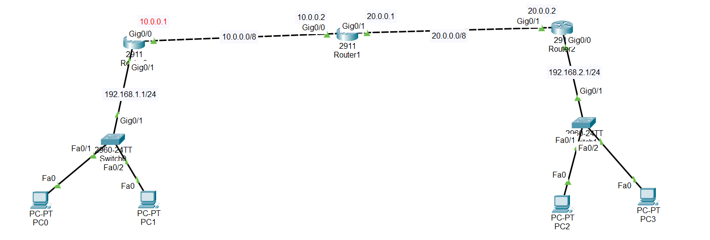

#Overview 

EIGRP is a Cisco routing protocol that allows routers to automatically share routes with each other.

Instead of adding routes manually, routers learn paths by talking to neighbors.

In Packet Tracer, EIGRP is easy to configure using few commands, but all routers must follow the same rules.

## 1.Before Configuring EIGRP

- IP addresses must be correct

- Interfaces must be up

- Routers must ping each other

👉 If this fails, EIGRP will not work.

## 2.1Autonomous System Number (AS)

- Written as: router eigrp 1

- The number 1 is the AS number

- All routers must use the same number

## 3.Network Command

- Used to advertise connected networks

- Tells the router where to run EIGRP

## 4.Wildcard 

- Defines which IP range to include

- Used for subnet control

## 5.Adjacency 

- When routers become neighbors

- They exchange routing information

- No adjacency = no routing

## 6.Checking if EIGRP Works

- show ip route → EIGRP routes show with D

- show ip eigrp neighbors → shows neighbors

## 7.Remove Network

- no network your_network

- Stops advertising that network.

- Disable EIGRP

- no router eigrp (process-id)

- Turns off EIGRP.

##📥 Download Packet Tracer Topology

Click below to download the EIGRP lab topology:

👉 [Download EIGRP Packet Tracer Lab](https://github.com/USERNAME/REPO/raw/main/configure_EIGR_in_packet_tracer.pkt)

## 8.Lab Tasks

1.assign ip addredress to each interface router

2.Confiure the Eigrp in all the three routers

Lab Configuration

TAsk1

assign ip addresses to routers interfaces 

Router0

Router(config)#int gig0/1

Router(config-if)#ip add 192.168.1.1 255.255.255.0

Router(config-if)#no shut

Router0

Router(config)#int gig0/0

Router(config-if)#ip add 10.0.0.1 255.0.0.0 

Router(config-if)#no shut

Router1

Router(config)#int gig0/0

Router(config-if)#ip add 10.0.0.2 255.0.0.0

Router(config-if)#no shut

Router1

Router(config)#int gig0/1

Router(config-if)#ip add 20.0.0.1 255.0.0.0

Router(config-if)#no shut

Router2

Router(config)#int gig0/1

Router(config-if)#ip add 20.0.0.2 255.0.0.0

Router(config-if)#no shut

Router2

Router(config)#int gig0/0

Router(config-if)#ip add 192.168.2.1 255.255.255.0

Router(config-if)#no shut

Task2 

Confiure the Eigrp in all the three routers

Router0

Router(config)#router eigrp 1

Router(config-router)#network 192.168.1.0 0.0.0.255

Router(config-router)#network 10.0.0.0 0.255.255.255

Router1

Router(config)#router eigrp 1

Router(config-router)#network 10.0.0.0 0.255.255.255

Router(config-router)#network 20.0.0.0 0.255.255.255

Router2

Router(config)#router eigrp 1

Router(config-router)#network 20.0.0.0 0.255.255.255

Router(config-router)#network 192.168.2.0 0.0.0.255
 

##  9Tis is the ping prove from network A(192.168.1.0/24) to network B(192.168.2.0/24)

:\>ping 192.168.2.2

Pinging 192.168.2.2 with 32 bytes of data:

Reply from 192.168.2.2: bytes=32 time<1ms TTL=125

Reply from 192.168.2.2: bytes=32 time=12ms TTL=125

Reply from 192.168.2.2: bytes=32 time=15ms TTL=125

Reply from 192.168.2.2: bytes=32 time=14ms TTL=125

Ping statistics for 192.168.2.2:
    
	Packets: Sent = 4, Received = 4, Lost = 0 (0% loss),

Approximate round trip times in milli-seconds:
    
	Minimum = 0ms, Maximum = 15ms, Average = 10ms
	
	
	
## 10.Commad to check the configuration

  1.Check routing table:
	
	show ip route
	
  2.Check neighbors:
	
    show ip eigrp neighbors
	
## 11.Removing or Disabling EIGRP:

  1.Remove a specific network:
  
    no network 10.0.0.0
  
  2.Disable EIGRP completely:
  
    no router eigrp 1

    

    

	

	
	
	

