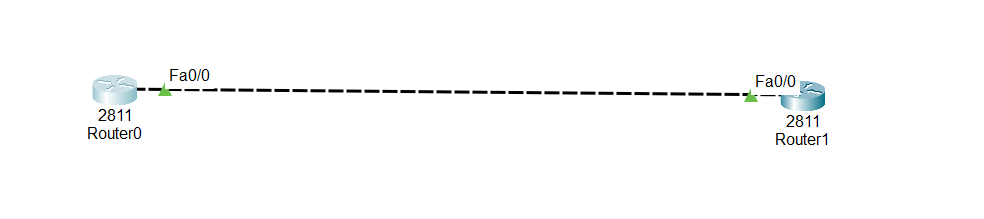

#Overview of EIGRP Authentication

EIGRP authentication is a security feature in Cisco routers.

It ensures that only trusted routers can exchange routing updates.

Routers use a key (password) to authenticate neighbors before forming an adjacency.

If authentication fails, routers will not share routes.

Cisco uses MD5 encryption for secure authentication.

## 1.What is EIGRP Authentication? (Very Easy)

EIGRP authentication is a security feature.

It means:

Routers must prove they are trusted before sharing routing updates.

If authentication is wrong or missing:

❌ Routers will NOT become neighbors

❌ Routes will NOT be shared

## 2.Why EIGRP Authentication is Used

- Protects routing tables

- Stops fake or hacker routers

- Only routers with the same password can exchange routes

## 3.What Method is Used?

Cisco uses MD5 authentication

👉 It checks a secret key (password) before accepting updates

## 4.Important Rule (Very Important)

For EIGRP authentication to work:

✔ Same AS number

✔ Same key chain name

✔ Same key number

✔ Same key string (password)

✔ Configured on the same interface

If ONE is wrong → authentication fails ❌

## 5.What Happens When Authentication Fails?

- relationship does not form

- You see error messages on CLI

- No EIGRP routes appear in routing table

## 6.Repeat on the Other Router

⚠️ Do the exact same configuration:

1. Same AS number (10)

2. Same key chain name (ali)

3. Same key number (1)

4. Same key string (ali1)

## 7.How to Check if It Works

show ip eigrp neighbors

✔ If neighbors appear → authentication is successful

## 8.Troubleshooting (Very Easy)

If EIGRP authentication fails, check:

1. Same key-string on both routers?

2. Same key chain name?

3. Same AS number?

Authentication applied on correct interface?

##📥 Download Packet Tracer Topology

Click below to download the EIGRP-Authentication lab topology:

👉 [Download EIGRP-Authentication Packet Tracer Lab](https://github.com/USERNAME/REPO/raw/main/EIGRP_authentication_configuration.pkt)

## 9.Lab Task

assign ip addresses to the interfaces

Configure the EIGRP authentication

Lab configuartion

assign ip addresses to the interfaces

Task1

Router0

Router(config)#int fa0/0

Router(config-if)#ip add 192.168.1.1 255.255.255.0

Router(config-if)#no shut

Router1

Router(config)#int fa0/0

Router(config-if)#ip add 192.168.2.1 255.255.255.0

Router(config-if)#no shut

Task2

Configure the EIGRP authentication

router0

Router(config)#router eigrp 10

Router(config-router)#network 192.168.1.0 0.0.0.255

router1

Router(config)#router eigrp 10

Router(config-router)#network 192.168.2.0 0.0.0.255

router0

Router(config)#int fa0/0

Router(config-if)#ip authentication mode eigrp 10 md5

Router(config-if)#ip authentication key-chain eigrp 10 ali

Router(config-if)#exit

Router(config)#key chain ali

Router(config-keychain)#

Router(config-keychain)#key 1

Router(config-keychain-key)#

Router(config-keychain-key)#key-string ali1

router1
Router(config)#int fa0/0

Router(config-if)#ip authentication mode eigrp 10 md5

Router(config-if)#ip authentication key-chain eigrp 10 ali

Router(config-if)#exit

Router(config)#key chain ali

Router(config-keychain)#

Router(config-keychain)#key 1

Router(config-keychain-key)#

Router(config-keychain-key)#key-string ali1

## 12.commad Checking if it works
  
     1. Check EIGRP neighbors:
	 
	     show ip eigrp neighbors

	 2. Check routing table:
	    
		show ip route
     
	 3. heck interface authentication status:
	    
		show running-config
	 
	   
