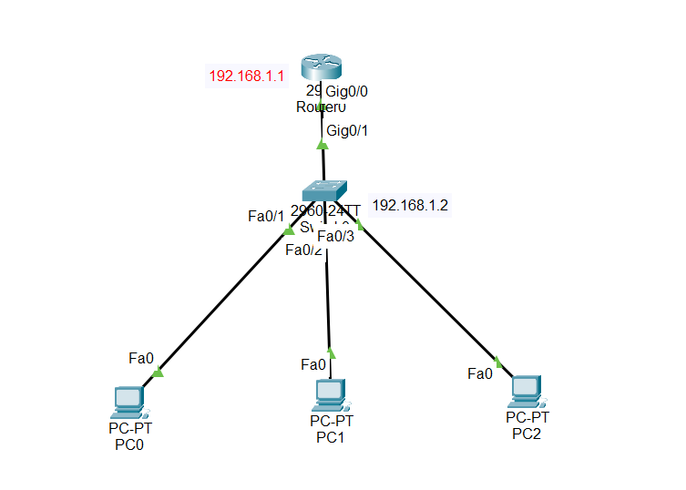

#Overview

In this lab, we configure a Cisco switch for basic functionality. This includes:

- Assigning an IP address to VLAN1 (so the switch can be accessed remotely).

- Setting a default gateway (so the switch can communicate with other networks).

- Disabling unnecessary features that slow the switch.

- Synchronizing status messages for easy CLI use.

Saving the configuration.

## 1.Step-by-Step Explanation

- VLAN1 IP Address

- VLAN1 is the default management interface of the switch.

- Assign an IP to VLAN1 so you can connect remotely (via Telnet).

- IP must be on the same network as the default gateway.

## 2.Commands:

Switch> enable

Switch# configure terminal

Switch(config)# interface vlan 1

Switch(config-if)# ip address 192.168.1.2 255.255.255.0

Switch(config-if)# no shutdown

## 3.Default Gateway

- Tells the switch where to send traffic outside its network.

- Must be on the same network as VLAN1 IP.

Command:

Switch(config)# ip default-gateway 192.168.1.1

## 4.Disable Domain Lookup

By default, Cisco switches try to resolve unknown commands as hostnames, which causes a 60-second delay.

Disable it to save time and avoid freeze.

Command:

Switch(config)#no ip domain-lookup

## 5.Logging Synchronous

Status messages (like errors) appear while you type.

This command synchronizes messages, so typing is not interrupted.

Command:

Switch(config)# logging synchronous

## 6.Save Configuration

Configuration changes are temporary until saved.

Save to startup-config so it remains after reboot.

Commands:

Switch# write

or

Switch# copy running-config startup-config

## 7.Key Notes

1. VLAN1 is for management only.

2. IP and default gateway must be in the same network.

3. Disable domain lookup to avoid freezes.

4. Logging synchronous keeps CLI clean and readable.

5. Always save configuration to prevent loss after reboot

##📥 Download Packet Tracer Topology

Click below to download the BASIC_SWITCH_CONFIG lab topology:

👉 [Download BASIC_SWITCH_CONFIG labPacket Tracer Lab](https://github.com/USERNAME/REPO/raw/main/Basic_switch_configuration.pkt)

## 8.Lab tasks

1. Assign IP address of the switch – 192.168.2.2/24

1. Set default gateway of the switch to 192.168.1.1

3. Save configuration

4. Disable domain lookup

5. Synchronize switch’s status messages

Lab Configuration

Task 1

IP address of the switch – 192.168.2.2/24

Switch(config)#int vlan1

Switch(config-if)#ip address 192.168.2.1 255.255.255.0

Switch(config-if)#no shut

Task 2

Set default gateway of the switch to 192.168.1.1

Switch(config)#ip default-gateway 192.168.1.1

Task 3

Save configuration

Switch#write

Building configuration...
[OK]

Task 4

Disable domain lookup

Switch(config)#no ip domain-lookup

Task 5

Synchronize switch’s status messages

Switch(config-line)#logging synchronous

Switch(config-line)#

## 9.The command of checking

   1. Check VLAN1 IP address:
   
       show running-config
   
   2. or
   
     show ip interface brief
	 
   3. Check logging synchronous
   
     show running-config
	 
	 NB:always right these command for cheking in privilege EXEC mode

