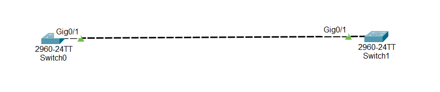

#Overview: Speed and Duplex in Networking

Network devices like switches and hubs use duplex modes to control how data is sent and received. Proper duplex settings ensure fast and reliable network communication.

# 1. Types of Communication

## 1Simplex

- Data flows in one direction only.

- Receiver cannot send back data.

- Example: TV (only receives signals).

## 2Half Duplex

- Data can be sent or received, but not at the same time.

- Slower than full duplex.

- Example: Walkie-talkie or radio.

## 3.Full Duplex

- Data can be sent and received simultaneously.

- Bandwidth is effectively doubled.

- Avoids collisions and increases network speed.

- Example: Telephone conversation.

## 4.Why Full Duplex is Important

- If switches have duplex mismatch, collisions occur → slows network.

- Hubs only support half duplex → cannot use full bandwidth.

- Configuring full duplex on both devices ensures maximum speed and reliability.

## 5. Auto-Negotiation vs Manual Settings

Cisco devices can auto-negotiate speed/duplex.

Sometimes auto-negotiation fails → causes duplex mismatch and network collisions.

Best practice: Manually set speed and duplex for important connections.

##📥 Download Packet Tracer Topology

Click below to download the FULL-DUPLEX-SWITCH lab topology:

👉 [Download FULL-DUPLEX-SWITCHPacket Tracer Lab](https://github.com/USERNAME/REPO/raw/main/100Mb_Full_Duplex_configuration_on_switch.pkt)

## 6.Lab Tasks

1. Hard-code interface fastethernet 0/1 to both switches to full duplex.

2. Hard-code Speed to 100 Mbps.

Lab Configuration

Task 1

Hard-code interface gig 0/1 to both switches to full duplex.

switch0

Switch(config)#int gig0/1

Switch(config-if)#duplex full

Switch1 

Switch(config)#int gig0/1

Switch(config-if)#duplex full

Task 2

Hard-code Speed to 100 Mbps.

Switch0

Switch(config-if)#speed 100

Switch1

Switch(config-if)#speed 100

## 7.Commmad to check the configuration
 
    1. Check interface status, speed, and duplex
	   
	      show interfaces

   2. Check summary of interfaces
   
        show interfaces status

   NB:always right these command for cheking in privilege EXEC mode