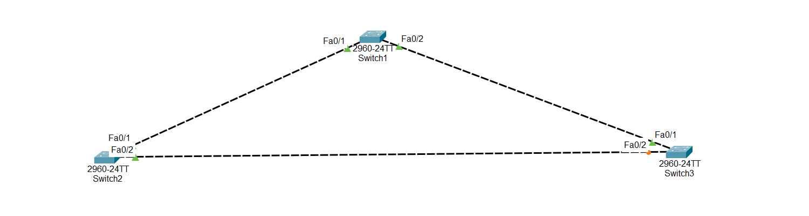

#Overview: Spanning Tree Protocol (STP)

In a network, sometimes we connect switches with multiple links to prevent failures. These redundant links are good for reliability but can create loops in the network, which can cause broadcast storms and network problems.

The Spanning Tree Protocol (STP) is used to prevent loops by selecting the best path and blocking redundant links.

## 1. How STP Works

- STP selects one switch as the Root Bridge (main switch).

- All other switches calculate the best path to reach the Root Bridge.

- Any extra/redundant paths are blocked to prevent loops.

## 2. Root Bridge Selection

- The Root Bridge is the most important switch in the network.

- Selection is based on Bridge ID, which consists of:

- Priority number (default = 32768)

- address of the switch

- The switch with the lowest Bridge ID becomes the Root Bridge.

- If the Root Bridge is slow, the entire network slows down, so choosing the best switch as Root is important.

## 3. How to Influence Root Bridge Selection

- We cannot change the MAC address of a switch.

- We can change the priority number to make a specific switch the Root Bridge.

- STP runs per VLAN, so you can choose the Root Bridge for each VLAN.

## 4. Versions of STP

- Standard STP: Works automatically but slower convergence.

- Rapid Spanning Tree Protocol (RSTP): Faster version, quickly blocks redundant links and recovers from failures.

## 5. Lab Goal

1. Select a switch of your choice as the Root Bridge by changing its priority number.

2. Specify for which VLAN this switch is the Root.

3. Enable Rapid Spanning Tree for faster network convergence.

##📥 Download Packet Tracer Topology

Click below to download the STP_CONFIG lab topology:

👉 [Download STP_CONFIG Packet Tracer Lab](https://github.com/USERNAME/REPO/raw/Configuartion_STP_Network_on_Switch.pkt)

## 6.Lab Tasks

1. Select switch 1 as a root bridge

2. Enable rapid spanning tree protocol

Lab Configuration

Task 1

Select switch 1 as a root bridge

Switch1

Switch(config)#spanning-tree vlan 1 priority 0  

Task 2

Enable rapid spanning tree protocol

Swicth1

Switch(config)#spanning-tree mode rapid-pvst

Switch2

Switch(config)#spanning-tree mode rapid-pvst

Switch3

Switch(config)#spanning-tree mode rapid-pvst

  ## 7.Commmad to check the configuration
  
      1. Check STP status and root bridge:
	    
		show spanning-tree

       2. Check which switch is root for a VLAN:
	   
	     show spanning-tree vlan 
       
	   3. Check STP mode:
	   
	     show spanning-tree summary
		 
	NB:always right these command for cheking in privilege EXEC mode	 
 
        

   

