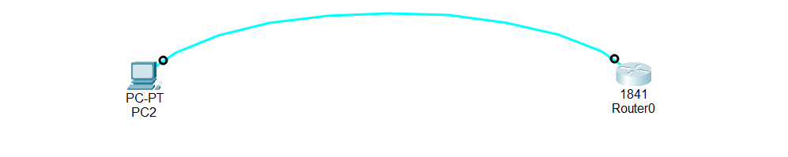

#Lab Overview: Configuring MOTD Banner and Enabling It for Telnet (Packet Tracer)

This lab focuses on basic router setup and security awareness. You will learn how to:

- Configure an IP address on a router interface

- Add a description (name) to an interface

- Configure a Message of the Day (MOTD) banner

- Enable the MOTD banner for Telnet (VTY lines)

- These steps are very important for network management and security.

## 1. Configuring an IP Address on a Router Interface

Every router interface must have an IP address so it can communicate with other devices on the network.

To configure an IP address:

- must enter interface configuration mode

- Assign the IP address and subnet mask

- Enable the interface using the no shutdown command

- This allows the router to send and receive data through that interface.

## 2. Naming (Describing) the Interface

In real networks, routers can have many interfaces connected to different locations such as:

- Branch offices

- Data centers

- Internet links

- To make management easier, network administrators use interface descriptions.

## 3.Why interface descriptions are important:

- They show where the interface is connected

- They help during troubleshooting

- They save time in large networks

Example:

If an interface connects to a branch office, naming it “Branch Office Interface” clearly tells the admin its purpose.

This is a best practice in networking.

## 4. What Is MOTD (Message of the Day)?

- MOTD stands for Message of the Day.

- It is a message that appears when a user logs into a Cisco device.

Purpose of MOTD:

- Warn against unauthorized access

- Inform users that the device is protected

- Display legal or security notices

Common uses:

- Security warning messages

- Short access notices

- Simple ASCII art (optional)

Best practice:

- Keep the MOTD short and clear

- Avoid long messages

- Large banners can use extra CPU resources, which is unnecessary

- Example of a good MOTD:

“Unauthorized access is strictly prohibited.”

## 5. Configuring the MOTD Banner

The MOTD banner is configured in global configuration mode.

Once configured:

- It appears when a user logs in locally

- It appears during console access

## 6. MOTD Banner and Telnet (Important Concept)

By default, MOTD banners do NOT appear when a user connects using Telnet.

This means:

A Telnet user can log in without seeing the warning message

This is not good for security

## 7. Enabling MOTD Banner for Telnet (VTY Lines)

- Telnet connections use VTY (Virtual Terminal) lines.

- To make the MOTD banner appear during Telnet login:

- You must enter VTY line configuration mode

- Enable the banner using the motd-banner command

Why this is important:

- Ensures all users see the warning message

- Improves security awareness

- Applies security policy consistently

Once enabled:

- Console users see the MOTD

- Telnet users also see the MOTD

## 8.Summary (Key Points)

- Interface IP configuration allows communication

- Interface descriptions help in management and troubleshooting

- MOTD banner shows a warning or message at login

- Best practice is to keep MOTD short and clear

- MOTD does not show for Telnet by default

- motd-banner on VTY lines enables MOTD for Telnet

##📥 Download Packet Tracer Topology

Click below to download the MOTD-Banner lab topology:

👉 [Download MOTD-Banner  Packet Tracer Lab](https://github.com/USERNAME/REPO/raw/main/Config-MOTD-banner_telnet_lines.pkt)

## 9.Lab Tasks

1. Access router via console connection

2. Set interface fast Ethernet 0/0 to 192.128.1.1 255.255.255.0 

3. Set interface fast Ethernet description to BRANCH OFFICE INTERFACE

4. Set MOTD as —- UNAUTHORIZED ACCESS IS NOT ALLOWED —-

ab Configuration

Task 1

Access router via console connection

Click on pc2 > click desktop tab > click on terminal > click ok

(you should be able to access router now)

Task 2

Set interface fast Ethernet 0/0 to 192.128.1.1 255.255.255.0 

Router(config)#int fa0/0

Router(config-if)#ip add 192.168.1.1 255.255.255.0

Router(config-if)#no shut

Task 3

Set interface fast Ethernet description to BRANCH OFFICE INTERFACE

Router(config-if)#description BRANCH OFFICE INTERFACE

Task 4

Set MOTD as —- UNAUTHORIZED ACCESS IS NOT ALLOWED —-

Router(config)#banner motd #UNAUTHORIZED ACCESS IS NOT ALLOWED#

  ## 10.Commmad to check the configuration
  
  1. Check MOTD Banner
  
     show running-config

   

