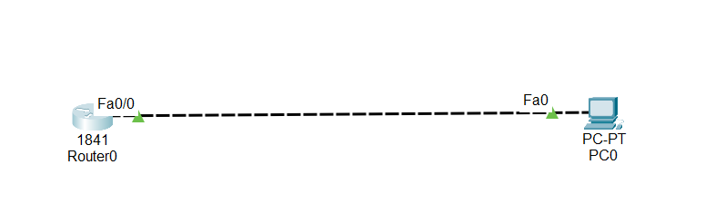

#Lab Overview: Telnet Configuration in Cisco Packet Tracer

This lab explains how to configure Telnet access on a Cisco router and how to connect to the router remotely from a PC using the command line. Telnet allows administrators to manage network devices without being physically connected to them.

## 1.What Is Telnet?

Telnet is a network protocol developed in 1969.

It allows a user to connect to a remote device using the Command Line Interface (CLI).

## 2.Key points about Telnet:

- It is part of the TCP/IP protocol suite

- It provides remote command-line access

- It sends data in plain text (not secure)

- It is mainly used for learning and testing, not for secure production networks

## 3.Telnet Clients

To use Telnet:

- The client device must have a Telnet client

- The remote device (router/switch) must be configured to accept Telnet connections

Examples of Telnet clients:

Command Prompt (Windows)

PuTTY (popular, free, open-source)

PuTTY supports both Telnet and SSH

Widely used in organizations

In Packet Tracer, we usually use:

PC Command Prompt as the Telnet client

## 4.Lab Goal

- In this Packet Tracer lab, we will:

- Configure a router to accept Telnet connections

- Assign IP addresses to the PC and router

- Configure VTY lines on the router

Test the Telnet connection from the PC

IP Address Requirement

Telnet works over the network, so:

The PC must have an IP address

The router interface must have an IP address

## 5.Important rule:

Telnet cannot work without IP addresses

Because the PC and router are directly connected, they must be:

In the same network

Using the same subnet

Enabling Telnet on the Router (VTY Lines)

Cisco routers use VTY (Virtual Terminal) lines for remote access.

## 6.Why VTY lines are important:

They control Telnet and SSH access

They define how many users can connect remotely

When we configure:

line vty 0 15

It means:

16 simultaneous Telnet connections are allowed

Multiple administrators can log in at the same time

This is common in large networks where many admins manage one device.

## 7.Testing Connectivity

Before using Telnet, we must:

Ping the router from the PC

Confirm that the router responds

If ping fails:

Telnet will not work

Ping confirms:

IP addressing is correct

Physical connection is working

Establishing Telnet Connection

Once connectivity is confirmed:

Open Command Prompt on the PC

Use the Telnet command to connect to the router’s IP address

If Telnet is configured correctly:

The router will ask for a password

After entering the password, access is granted

## 8.Privileged Mode Password (Very Important)

To fully manage the router:

We must enter privileged EXEC mode (enable)

For Telnet access:

The router must have a privileged mode password set

Usually done using the enable secret command

If no privileged password is set:

Telnet login works

But entering privileged mode fails

Error message appears:

“No password set”

This is why configuring the enable password/secret is mandatory.

##📥 Download Packet Tracer Topology

Click below to download the TELNET-CONFIG lab topology:

👉 [Download TELNET-CONFIG  Packet Tracer Lab](https://github.com/USERNAME/REPO/raw/main/Telnet_config_on_router.pkt)

## 9.Lab tasks

1. Set pc0 IP address to 192.168.1.2/24

2. Set interface fast Ethernet 0/0 IP address to 192.168.1.1/24

3. Set privileged mode password to Cisco

4. Enable telnet lines on router

5. Test telnet connection via your PC

Lab Configurations

Task 1

Set pc0 IP address to 192.168.1.2/24

Click on pc0 > Click on desktop tab > Click on ip configuration> Set ip address

Task 2

Set interface fast Ethernet 0/0 IP address to 192.168.1.1/24

Router(config)#int fa0/0

Router(config-if)#ip add 192.168.1.1 255.255.255.0

Router(config-if)#no shut

Task 3

Set privileged mode password to ali2

Router(config)#enable secret ali2

Router(config)#

Task 4

Enable telnet lines on router

Router(config)#line vty 0 15

Router(config-line)#password ali1

Router(config-line)#login

Task 5

Test telnet connection via your PC

Click on pc0 > Click on command prompt > type telnet 192.168.1.1 > type privileged mode password

  
  
  ## 10.Commmad to check the configuration
	
	1. Check VTY Lines Configuration
	
	  show running-config

   