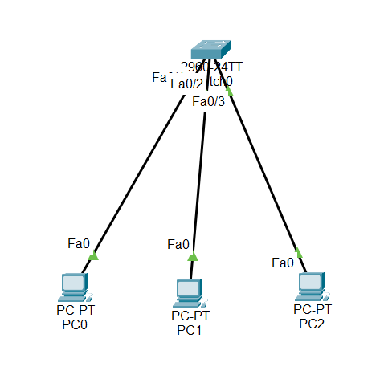

#Overview: Switch Port Security

Port Security is a Cisco switch feature used to control which devices are allowed to connect to a switch port.

It works by restricting MAC addresses on a physical interface, helping to prevent unauthorized access to the network.

This feature is especially useful in offices where users may connect personal or unknown devices to open switch ports, which can create security risks.

## 1.Why Port Security Is Needed

Prevents unauthorized devices from connecting

Protects the network from internal attacks

Limits misuse of open switch ports

Makes network access more controlled and secure

Port security does not provide 100% protection, but it significantly reduces the risk of unauthorized access.

## 2.Port Security Behavior in This Lab

Only one MAC address is allowed on FastEthernet 0/2

If another device connects:

- The port enters shutdown (err-disabled) state

- The switch port LED turns amber

- Administrator can easily detect the issue

Important Requirement

- security works only in access mode.

- By default, switch ports are in dynamic mode, so the mode must be changed first.

##📥 Download Packet Tracer Topology

Click below to download the switch_port_security lab topology:

👉 [Download switch_port_security Tracer Lab](https://github.com/USERNAME/REPO/raw/main/switch_port_security.pkt)

## 3.Lab Tasks

1. Set maximum number of allowed mac addresses to port fastethernet 0/2 to 1

2. Port 0/2 should go to shutdown state if other mac address device try to connect

Lab Configuration

Task 1

Switch(config)#interface fastethernet 0/2

Switch(config-if)#switchport mode access

Switch(config-if)#switchport port-security

Switch(config-if)#switchport port-security maximum 1

 

Task 2

Switch(config-if)#switchport port-security violation shutdown