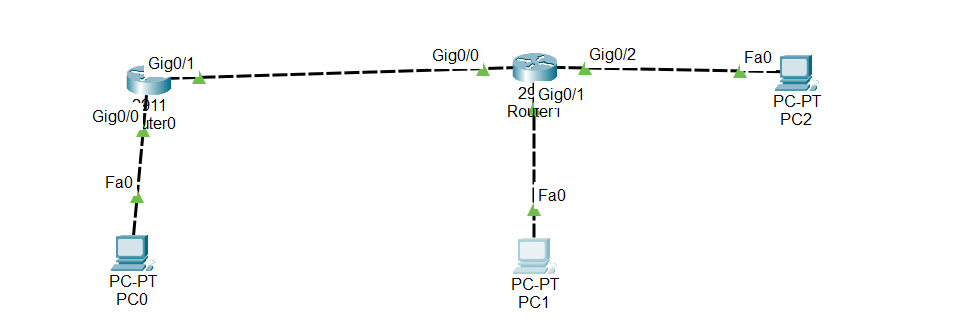

#Overview of ACLs (Access Control Lists)

An ACL is a rule set on a router (or firewall) that controls network traffic. It decides which packets are allowed and which are blocked based on certain conditions like:

- Source IP

- Destination IP

- Protocols (TCP, UDP, ICMP)

- Port numbers

ACLs are useful to improve security, control traffic, and prevent unauthorized access.

## 1.Key Points About ACLs

Order Matters:

ACLs are read top to bottom.

The first rule that matches is applied; later rules are ignored.

Example:

Deny 192.168.1.0 0.0.0.255

Permit host 192.168.1.5

→ The whole network is denied first, so the second rule will never be applied.

## 2.Types of ACLs:

Standard ACL → Filters only by source IP address (simple, lightweight).

Extended ACL → Filters by source & destination IP, protocols, ports (more powerful, more CPU usage).

## 3.Standard ACL

Purpose: Block traffic based only on the source IP.

Example Lab: Block PC0 from reaching Router2

1. Create ACL

Router(config)# access-list 1 deny 192.168.1.1

Router(config)# access-list 1 permit any

deny 192.168.1.1 → blocks PC0

permit any → allows all other traffic

Important: Always include permit any unless you want to block everything else (default deny exists at the end).

2. Apply ACL to Router Interface

Router(config)# interface gigabitEthernet 0/1
Router(config-if)# ip access-group 1 out

ACL is applied in inbound or outbound direction

Filters traffic based on direction and interface

3. Test

From PC0, ping Router2 → packets are blocked

From other PCs, ping Router2 → packets are allowed

4. Verify ACL

Router# show access-lists

Shows how many packets were matched or blocked.

##📥 Download Packet Tracer Topology

Click below to download the ACL_CONFIG lab topology:

👉 [Download ACL_CONFIG Packet Tracer Lab](https://github.com/USERNAME/REPO/raw/main/Standard_ACL_config.pkt)

## 4.Lab Task
1. Cereate Standard ACL to block Pc0 192.168.1.1 to accesss Router0

2. Apply ACL to Router Interface

Lab configuration

Task 1

1. Cereate Standard ACL to block Pc0 192.168.1.1 to accesss Router0

Router(config)#access-list 1 deny 192.168.1.1

Router(config)#access-list 1 permit any

Task 2

2.Apply ACL to Router Interface

Router(config)#int gig0/1

Router(config-if)#ip access-group 1 out

  
  
  ## 6.Commmad to check the configuration
  
      1. Verify ACL:
	  
	    show access-lists
		
		
	     
  
  
