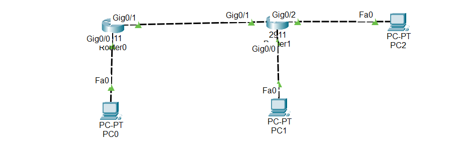

#Overview of ACLs (Access Control Lists)

An ACL is a rule set on a router (or firewall) that controls network traffic. It decides which packets are allowed and which are blocked based on certain conditions like:

- Source IP

- Destination IP

- Protocols (TCP, UDP, ICMP)

- Port numbers

ACLs are useful to improve security, control traffic, and prevent unauthorized access.

## 1.Key Points About ACLs

Order Matters:

ACLs are read top to bottom.

The first rule that matches is applied; later rules are ignored.

Example:

Deny 192.168.1.0 0.0.0.255

Permit host 192.168.1.5

→ The whole network is denied first, so the second rule will never be applied.

Types of ACLs:

Standard ACL → Filters only by source IP address (simple, lightweight).

Extended ACL → Filters by source & destination IP, protocols, ports (more powerful, more CPU usage).

##2.Extended ACL

Purpose: Block traffic based on source & destination IP, protocol, and port.

Example Lab: Block PC2 from pinging any device

1. Create ACL

Router(config)# ip access-list extended 100

Router(config-ext-nacl)# deny icmp host 192.168.3.2 any

Router(config-ext-nacl)# permit ip any any

deny icmp host 192.168.3.2 any → blocks ping (ICMP) from PC2

permit ip any any → allows all other traffic

2. Apply ACL

Router(config)# interface gigabitEthernet 0/0

Router(config-if)# ip access-group 100 in

3. Test

From PC2, ping any device → blocked

Other traffic (like HTTP) → allowed

4. Verify ACL

Router# show access-lists

Shows matches (number of blocked packets)

##📥 Download Packet Tracer Topology

Click below to download the ACL-CONFIG lab topology:

👉 [Download ACL-CONFIG Packet Tracer Lab](https://github.com/USERNAME/REPO/raw/main/Extended_ACL_config.pkt)

## 3.Task Lab

1. Create Extended ACL to block Pc2 form Roure 2 to ping any devices in the network

2. Apply Extended ACL on the router 2 interface that connected to pc2

configuration Lab

Task 1

1. Create Extended ACL to block Pc2 form Roure 2 to ping any devices in the network

Router(config)#ip access-list extended 100

Router(config-ext-nacl)#deny icmp host 192.168.3.2 any

Router(config-ext-nacl)#permit ip any any

Task 2

2. Apply Extended ACL on the router 2 interface that connected to pc2

Router(config)#int gig0/0

Router(config-if)#ip access-group 100 in

   
     
  ## 5.Commmad to check the configuration
  
    1. Verify ACL:
	  
	    show access-lists

