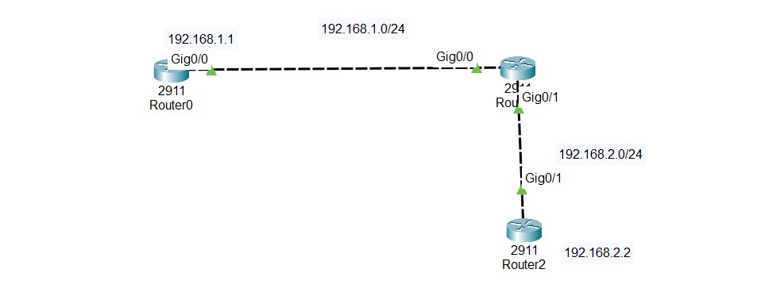

#Static Routing – Overview and Explanation

## 1.What is a Static Route?

A static route is a route that is manually configured by a network administrator on a router.

The router does not learn this route automatically.

You must tell the router exactly where to send traffic.

Static routes are best for:

Small networks

Few routers

Networks that rarely change

## 2.Why Use Static Routes?

✅ Advantages

- Easy to understand

- Easy to configure

- Uses very little CPU and memory

Very stable (does not change unless you change it)

❌ Disadvantages

- Not suitable for large networks

- Must be updated manually

- Time-consuming if many routes exist

- No automatic backup route if a link fails

- Because of these limitations, dynamic routing protocols (RIP, OSPF, EIGRP) are used in large networks.

## 3.Basic Static Routing Concept

A router can only:

Reach networks directly connected to it

Reach other networks only if routes exist

If a router does not know a network:

➡️ It will drop the packet

So we must manually add routes.

Example Network (Simple)

Network 192.168.1.0 --- Router0 --- Router1 --- Router2 --- Network 192.168.2.0

What routers know by default:

Router0 knows only its directly connected network

Router1 knows both networks connected to it

Router2 knows only its own network

Why Static Routes Are Needed

Router0 cannot reach Router2’s network

Router2 cannot reach Router0’s network

So we must add static routes.

## 4.Static Route Command Syntax

ip route [destination-network] [subnet-mask] [next-hop IP]

##📥 Download Packet Tracer Topology

Click below to download the STATIC-ROUTE lab topology:

👉 [Download STATIC-ROUTE Packet Tracer Lab](https://github.com/USERNAME/REPO/raw/main/Static_route_config.pkt)

## 5.Lab Tasks

1.configure ip addresses on all routers and establish connectivity

2.create a static route on router 0 to reach 192.168.2.0/24 network

3.create a static route on router 2 to reach 192.168.1.0/24 network

4.Test connectivity by pinging router 2 from router 0

Lab Configuraion

Task 1

1.configure ip addresses on all routers and establish connectivity

Router0

Router(config)#int gig0/0

Router(config-if)#ip add 192.168.1.1 255.255.255.0

Router(config-if)#no shut

Router1

Router(config)#int gig0/0

Router(config-if)#ip add 192.168.1.2 255.255.255.0

Router(config-if)#no shut

Router1

Router(config)#int gig0/1

Router(config-if)#ip add 192.168.2.1 255.255.255.0

Router(config-if)#no shut

Router2

Router(config)#int gig0/1

Router(config-if)#ip add 192.168.2.2 255.255.255.0

Router(config-if)#no shut

Task 2

2.create a static route on router 0 to reach 192.168.2.0/24 network

Router0

Router(config)#ip route 192.168.2.0 255.255.255.0 192.168.1.2

Task 3

3.create a static route on router 2 to reach 192.168.1.0/24 network

Router2

Router(config)#ip route 192.168.1.0 255.255.255.0 192.168.2.1

Task 4

4.Test connectivity by pinging router 2 from router 0

Router>ping 192.168.2.2

Type escape sequence to abort.

Sending 5, 100-byte ICMP Echos to 192.168.2.2, timeout is 2 seconds:

..!!!

Success rate is 60 percent (3/5), round-trip min/avg/max = 0/1/3 ms

    ## 6.Commmad to check the configuration
	
	   1. Check Static Routes
	     
		 show ip route
        
		Or
		
	    show ip route static

	   
	   

