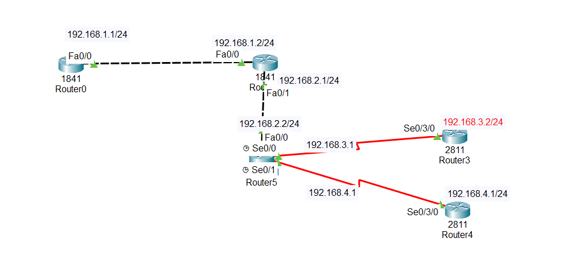

#Overview

A default static route is used by a router when it does not know the exact path to a destination network. Instead of dropping the packet, the router forwards the traffic to a predefined next hop or exit interface. This is especially important for sending traffic to external networks, such as the Internet, where it is impossible to store all possible routes.

In simple terms, a default route acts as a backup path or last option for forwarding traffic.

## 1.How Routers Forward Packets

- Before sending any packet, a router always checks its routing table.

- The router follows this order:

- Look for a specific route to the destination network

- If no specific route is found, look for a default route

-  If no default route exists, the packet is dropped

- Without a default route, a router cannot forward unknown traffic.

## 2.What Happens When a Default Route Is Configured

When a default route is configured:

Any packet with a destination not listed in the routing table

Is forwarded to the next-hop IP address or exit interface

Instead of being dropped

This allows the router to successfully forward traffic even when it does not know the exact destination.

## 3.Why Default Routes Are Important for the Internet

The Internet contains millions of networks.
It is not practical for a router to store routes for all of them.

So:

Routers use one default route

All unknown traffic is sent to the ISP router

The ISP then forwards the traffic further

This makes routing:

Simple

Efficient

Scalable

## 4.Default Route vs Default Gateway (LAN Comparison)

In a Local Area Network (LAN):

When a PC wants to reach another network

It sends the traffic to the default gateway (usually a router)

Similarly:

When a router does not know a destination

It sends the traffic to the default route

➡️ The default route on a router works the same way as a default gateway on a PC.

## 5.About the Lab Scenario

In this lab:

A default route is configured on the router

This allows communication between different subnets

No dynamic routing protocol is used

⚠️ This setup is not common in real-world networks

It is created only to demonstrate how default routing works

In real networks:

Default routes are mainly used on routers connected to the Internet

Because Packet Tracer cannot simulate the real Internet, this lab uses a simple internal topology to show the concept clearly.

## 6.Default Route Command Explanation

Command:

ip route 0.0.0.0 0.0.0.0 192.168.1.2

Explanation:

0.0.0.0 → Matches any destination IP address

0.0.0.0 → Matches any subnet mask

192.168.1.2 → The next-hop router IP address

📌 Meaning:

If the router does not find a destination in its routing table, it forwards the packet to 192.168.1.2.

##7.Default Route in the Routing Table

After configuration:

The default route appears as S* in the routing table

Regular static routes appear as S

Symbols:

S → Static route

S* → Default static route

* → Gateway of last resort

##8.Gateway of Last Resort

Before configuring a default route:

The gateway of last resort is not set

Unknown traffic is dropped

After configuring a default route:

The router sets the gateway of last resort

All unknown traffic is forwarded through that gateway

##9.Key Points to Remember ⭐

- A default route is used when no specific route exists

- It prevents packets from being dropped

- It is essential for Internet communication

- It acts like a default gateway for routers

- It appears as S* in the routing table

##📥 Download Packet Tracer Topology

Click below to download the DEFAULT-ROUTE lab topology:

👉 [Download DEFAULT-ROUTE Packet Tracer Lab](https://github.com/USERNAME/REPO/raw/main/Default_static_config.pkt)

##10.Lab Tasks

1.Create a default route on router 0 and 1 to reach network 192.168.3.0/24 and 192.168.4.0/24

2.Create a default route on router 2 to reach network 192.168.1.0/24

3.Create a default route on router 3 and 4 to reach network 192.168.1.0/24 and 192.168.2.0/24

4.Test Routing by pinging router 4 from router 0

Lab configurations

Task1

Create a default route on router 0 and 1 to reach network 192.168.3.0/24 and 192.168.4.0/24

Router0

Router(config)#ip route 0.0.0.0 0.0.0.0 192.168.1.2

Router1

Router(config)#ip route 0.0.0.0 0.0.0.0 192.168.2.2

Task2

Create a default route on router 2 to reach network 192.168.1.0/24

Router2

Router(config)#ip route 0.0.0.0 0.0.0.0 192.168.2.1

Task3

Create a default route on router 3 and 4 to reach network 192.168.1.0/24 and 192.168.2.0/24

Router3

Router(config)#ip route 0.0.0.0 0.0.0.0 192.168.3.1

Router4

Router(config)#ip route 0.0.0.0 0.0.0.0 192.168.4.1

Task4

Test Routing by pinging router 4 from router 0

Router0

Router>ping 192.168.4.2

Type escape sequence to abort.

Sending 5, 100-byte ICMP Echos to 192.168.4.2, timeout is 2 seconds:

..!!!

Success rate is 60 percent (3/5), round-trip min/avg/max = 1/4/12 ms

    ## 6.Commmad to check the configuration
	
	     1. Check Interface Status
		 
		    show ip interface brief
        
		2. Check Routing Table
		
		   show ip route
