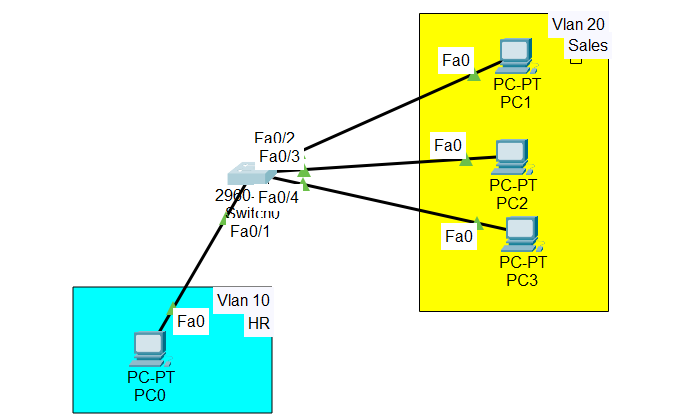

VLAN Configuration and Inter-VLAN Routing

#Overview

In this lab, we will:

1. Create VLANs on a switch

2.  names to VLANs for easier management

3. Assign switch ports to VLANs

5. VLANs (Virtual LANs) are used to segment a network logically, even if all devices are connected to the same physical switch. Each VLAN acts as a separate network, so devices in different VLANs cannot communicate unless routing is configured.

## 1. Creating VLANs and Naming Them

Why Name VLANs?

- Makes it easier for admins to identify VLANs

- Helps during troubleshooting or network outages

- Naming can reflect:

- VLAN purpose (e.g., Voice for IP phones)

- Department (e.g., Sales, Marketing)

Commands Example:

Switch(config)# vlan 10

Switch(config-vlan)# name HR

Switch(config)# vlan 20

Switch(config-vlan)# name Sales

Verification:

Switch# show vlan

This command shows all VLANs created, their names, and status.

## 2. Assigning Ports to VLANs

By default:

All switch ports belong to VLAN 1

To use VLANs, we must assign ports to the correct VLAN

Assign a single port to VLAN 10:

Switch(config)# interface fastEthernet 0/1

Switch(config-if)# switchport mode access

Switch(config-if)# switchport access vlan 10

Assign multiple ports to VLAN 20:

Switch(config)# interface range fastEthernet 0/2 - 6

Switch(config-if-range)# switchport mode access

Switch(config-if-range)# switchport access vlan 20

Verification:

Switch# show vlan

Assigned ports will appear under the respective VLANs.

##📥 Download Packet Tracer Topology

Click below to download the VALNs-CONFIG lab topology:

👉 [Download VALNs-CONFIG Packet Tracer Lab](https://github.com/USERNAME/REPO/raw/main/Create_and_configure_VLANs.pkt)

## 3.Lab Task

1. Create VLANs on a switch

2. Assign names to VLANs for easier management

3. Assign switch ports to VLANs

Lab configurations

Task1

1. Create VLANs on a switch

Switch(config)#vlan 10

Switch(config)#vlan 20

Task2

2. Assign names to VLANs for easier management

Switch(config)#vlan 10

Switch(config-vlan)#name HR

Switch(config)#vlan 20

Switch(config-vlan)#name Sales

Task3

3. Assign switch ports to VLANs

Switch(config)#int fa0/1

Switch(config-if)#switchport mode access

Switch(config-if)#switchport access vlan 10

Switch(config)#int range fa0/2-4

Switch(config-if-range)#switchport mode access

Switch(config-if-range)#switchport access vlan 20

       ## 4.Commmad to check the configuration
	
	        Switch# show vlan 
			
			switch# show trunk interfaces
			
			Switch# show ip interface brief

