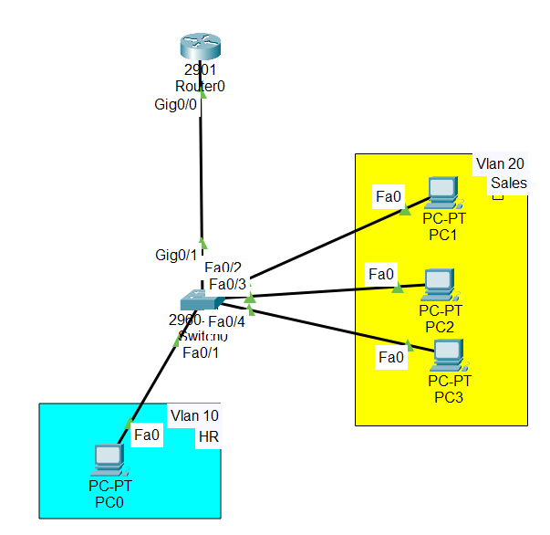

Router-on-a-Stick Configuration
#Overview

Router-on-a-Stick (RoS) is a method that allows a single router interface to route traffic between multiple VLANs.

Each VLAN is a separate subnet, and routers can typically handle only one subnet per interface.

Router-on-a-stick solves this by creating sub-interfaces on the single router interface.

A trunk link between the router and switch carries traffic from all VLANs.

This method is efficient, avoids wasting router interfaces, and is commonly used in small to medium networks where a Layer 3 switch may be too expensive.

## 1.Why Router-on-a-Stick is Needed

1. bProblem Without RoS

If you want to route between VLANs without sub-interfaces:

You need one physical interface per VLAN on both the router and switch

This uses many interfaces, becomes inefficient, and is not scalable for multiple VLANs.

2️. Router-on-a-Stick Solution

Use one physical router interface

Create sub-interfaces for each VLAN

Assign each sub-interface an IP address in the VLAN subnet

Connect the router interface to the switch trunk port

The router can now route traffic between all VLANs using only one interface

## 2.How It Works

Sub-Interfaces

Virtual interfaces on a single router physical interface

Trunk Link

The switch port connected to the router must be trunked

Carries traffic from all VLANs to the router

##3. Lab Tasks

1. Assign IP address and default gateway to the PC

2. Create Vlans and assign ports to the Vlans

3. Configure trunk connection between router and a switch

4. Create sub-interface and allow routing between the Vlans

##📥 Download Packet Tracer Topology

Click below to download the VALNs-CONFIG lab topology:

👉 [Download VALNs-CONFIG Packet Tracer Lab](https://github.com/USERNAME/REPO/raw/main/Router_on_a_Stick_Config.pkt)

Lab configuration

Task 1

Assign IP address and default gateway to the PC

Click on pc0 > click on desktop tab > click on IP configuration > set IP address and default gateway

Task 2

Create Vlans

Switch(config)#vlan 10

Switch(config-vlan)#name HR

Switch(config)#vlan 20

Switch(config-vlan)#name Sales

Task 3

assign ports to the Vlans

Switch(config)#int fa0/1

Switch(config-if)#switchport mode access

Switch(config-if)#switchport access vlan 10

Switch(config)#int range fa0/2-4

Switch(config-if-range)#switchport mode access

Switch(config-if-range)#switchport access vlan 20

Task 4

Configure trunk connection between router and a switch

Switch(config)#int gig0/1

Switch(config-if)#switchport mode trunk

Switch(config-if)#switchport trunk allowed vlan 10,20

Task 5

Create sub-interface and allow routing between the Vlans

Router(config)#int gig0/0.10

Router(config-subif)#encapsulation dot1q 10

Router(config-subif)#ip address 192.168.2.1 255.255.255.0

Router(config)#int gig0/0.20

Router(config-subif)#encapsulation dot1q 20

Router(config-subif)#ip address 192.168.3.1 255.255.255.0

          
		  
		  
		  ## 4.Commmad to check the configuration
	
	        Switch# show vlan brief
			
			switch# show trunk interfaces
			
			Switch# show ip interface brief

