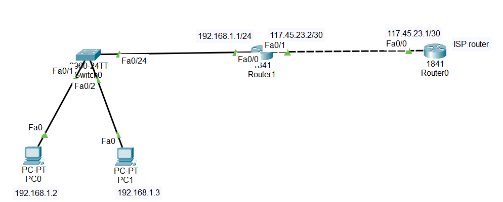

#Overview

## 1.What is NAT?

NAT (Network Address Translation) is a mechanism used on routers to translate IP addresses between two networks, typically:

- Private IP addresses (used inside an organization)

- Public IP addresses (used on the Internet)

## 2.Why NAT is Needed

Organizations usually have:

Many internal devices

Very few public IP addresses (expensive and limited)

- Without NAT:

Private IP devices cannot communicate with public networks

- With NAT:

Private addresses are translated to public addresses

Communication with the Internet becomes possible

## 3.Types of NAT (Overview)

1. Static NAT

One private IP ↔ one public IP

Permanent mapping

Used for servers (Web, Mail)

2. Dynamic NAT

Private IPs mapped to a pool of public IPs

One-to-one, but temporary

3. PAT (NAT Overload) — Most Common

Many private IPs → one public IP

Uses port numbers to distinguish traffic

Also called NAT with Overload

## 4.What is PAT (Port Address Translation)?

PAT allows multiple internal devices to share a single public IP address by using:

Source IP address

Source port number.

## 5. NAT Terminology (Professional)

Term	Meaning

Inside Local	Private IP of internal device

Inside Global	Public IP used to represent inside device

Outside Global	Public IP of external server

Outside Local	How external host appears internally

## 6.NAT Interfaces (Very Important)

A router must know:

Which interface is inside

Which interface is outside

ip nat inside

ip nat outside

This tells the router:

Where translation starts

Where translation ends

##📥 Download Packet Tracer Topology

Click below to download the NAT-CONFIG lab topology:

👉 [Download NAT-CONFIG Packet Tracer Lab](https://github.com/USERNAME/REPO/raw/main/NAT_and_PAT_config.pkt)

## 7.Lab Tasks

1. label the interfaces

2. create a access list to allow network 192.168.1.0/24 to be translated

3. Enable NAT with PAT

Lab Configuration

Task 1

label the interfaces

Router(config)#int fa0/0

Router(config-if)#ip nat inside

Router(config-if)#exit

Router(config)#int fa0/1

Router(config-if)#ip nat outside

Task 2

create a access list to allow network 192.168.1.0/24 to be translated

Router(config)#access-list 1 permit 192.168.1.0 0.0.0.255

Task2

Enable NAT with PAT

Router(config)#ip nat inside source list 1 interface fastethernet 0/1 overload

               
			   
			   
			## 9.Commmad to check the configuration
                
				1. Check NAT Translations:
				
				  show ip nat translations
                
				2. Check NAT Statistics:
				
				  show ip nat statistics

