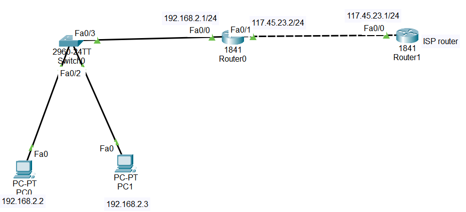

#Dynamic NAT Overview

##1.Dynamic NAT is a type of Network Address Translation used when:

You have many internal devices

You have multiple public IP addresses available

You want devices to access the Internet smoothly

## 2.Why Dynamic NAT is needed

Large organizations may have hundreds or thousands of devices

Using one public IP (even with PAT) can cause bottlenecks

Dynamic NAT solves this by using a pool of public IPs

Each internal device gets a public IP from the pool dynamically when needed

✅ This prevents congestion and allows many devices to access the Internet at the same time.

## 3.How Dynamic NAT works (in simple steps)

1. Router receives traffic from an internal device (private IP)

2. Router checks an ACL to see if the device is allowed to use NAT

3. Router picks a free IP from the public IP pool

3. Router translates the private IP to the selected public IP

4. Traffic goes to the Internet

5. When the session ends, the public IP returns to the pool to be used by another device

## 4.Lab Tasks

1. label the interfaces

2. create a access list to allow network 192.168.1.0/24 to be translated

3. create a pool of public IP addresses from 117.45.23.2 to 117.45.23.5

4. Enable NAT with PAT

##📥 Download Packet Tracer Topology

Click below to download the Dynamic_NAT lab topology:

👉 [Download Dynamic_NAT Packet Tracer Lab](https://github.com/USERNAME/REPO/raw/main/Dynamic_NAT_config.pkt)

## 7.Lab Tasks

Lab Configuration

Task 1

label the interfaces
 
Router(config)#int fa0/0

Router(config-if)#ip nat inside

Router(config-if)#exit

Router(config)#int fa0/1

Router(config-if)#ip nat outside 

Task 2

create a access list to allow network 192.168.1.0/24 to be translated

Router(config)#access-list 1 permit 192.168.1.0 0.0.0.255

Task 3

create a pool of public IP addresses from 117.45.23.2 to 117.45.23.5
 
Router(config)#ip nat pool public-ips 117.45.23.2 117.45.23.5 netmask 255.255.255.0

Task 4

Enable NAT with PAT
 
Router(config)#ip nat inside source list 1 pool public-ips overload

              ## 5.Commmad to check the configuration
			  
			       1. Check Dynamic NAT Translations
				   
				        show ip nat translations
                
				   2. Check NAT Statistics
				   
				       show ip nat statistics

