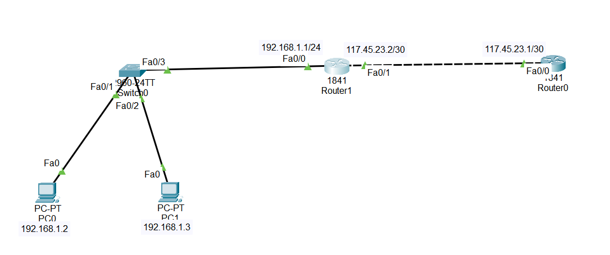

Static NAT – Overview & Packet Tracer Configuration

## 1.What is Static NAT?

Static NAT is a type of Network Address Translation where:

One private IP is permanently mapped to one public IP

The mapping is fixed (one-to-one)

## 2.Why Static NAT is used

Makes internal servers accessible from the Internet

Example: Web server, mail server, FTP server

Traffic from outside always reaches the same internal device

✅ Useful when you need consistent access from outside

3. How it works

Traffic comes to a public IP (assigned by ISP)

Router translates the public IP to the internal private IP

The internal device responds, and the router translates back

This translation is permanent and does not change dynamically

## 4.Example scenario

Internal Web Server: 192.168.1.10

Public IP: 200.1.1.10

Static NAT mapping:

All traffic to 200.1.1.10 → forwarded to 192.168.1.10

For HTTPS (port 443) or HTTP (port 80), you can also map ports individually

But 1 public IP = 1 static mapping

To host multiple web servers, you need more public IPs

##📥 Download Packet Tracer Topology

Click below to download the Static_NAT_config lab topology:

👉 [Download Static_NAT_config Packet Tracer Lab](https://github.com/USERNAME/REPO/raw/main/Static_NAT_config.pkt)

## 5.Lab Tasks

1. label the interfaces

2. Enable static NAT

Lab configurations

Task 1

label the interfaces

Router(config)#int fa0/0

Router(config-if)#ip nat inside

Router(config-if)#exit

Router(config)#int fa0/1

Router(config-if)#ip nat outside

Task 2

Enable static NAT

Router(config)#ip nat inside source static 192.168.1.1 117.45.23.2

          ## 6.Commmad to check the configuration

        1. Check Static NAT Translation:
		
		   show ip nat translations
          
		2. Check NAT Statistics:
		 
		 show ip nat statistics

