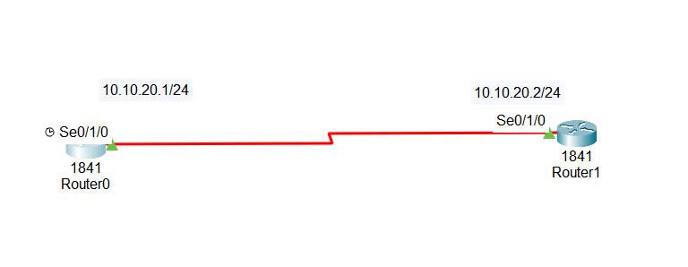

#What is a Serial Connection?

A Serial Connection is used to create a WAN (Wide Area Network) connection between two distant networks.

Used to connect different offices, branches, or sites

Distance can be hundreds or thousands of kilometers

Connection is provided by a service provider (ISP)

## 1.What is a Leased Line?

A leased line is:

A dedicated, always-on connection

Rented from a service provider

Used mainly by business organizations

📌 Companies pay based on:

Bandwidth (speed)

Service quality

## 2.Why Serial Connections are used

Reliable and stable WAN connection

Always available (no dialing)

Common in enterprise networks

In Cisco networks, serial interfaces are used to simulate these leased lines.

## 3.Serial Connection in Cisco Routers

When two routers are connected using a serial cable, one side will be:

DCE (Data Communication Equipment)

DTE (Data Terminal Equipment)

👉 Only the DCE side provides clocking (speed)

## 4.What is Clock Rate?

Clock rate defines the speed of the serial link

Measured in bits per second (bps)

Example:

clock rate 56000

➡ Means 56 Kbps speed

📌 In real life:

Service provider sets the clock rate

In Packet Tracer, we must configure it manually

## 5.Encapsulation (Very Important)

Encapsulation defines how data is packed at the Data Link layer.

## 6.HDLC (Default)

Default protocol on Cisco routers

Works only between Cisco routers

Proprietary (Cisco-only)

Limited features

## 7.PPP (Preferred)

Works with any vendor router

Industry standard

Supports:

Authentication (PAP, CHAP)

Error detection

Multiple protocols

✅ PPP is recommended in real networks

## 8.Why Encapsulation Must Match

Both routers must use the same encapsulation:

HDLC ↔ HDLC ✅

PPP ↔ PPP ✅

HDLC ↔ PPP ❌ (Link fails)

If mismatched:

Interface shows up/down

Data link layer fails

##📥 Download Packet Tracer Topology

Click below to download the Serial_connection_config  lab topology:

👉 [Download Serial_connection_config Packet Tracer Lab](https://github.com/USERNAME/REPO/raw/main/Serial_connection_config.pkt)

## 9.Lab Tasks

1. Assign IP address to both routers and turn them on

2. Set clocking on DCE side, which is router 0

Lab Configuration

Task1

Assign IP address to both routers and turn them on

Router0

Router(config)#int se0/1/0

Router(config-if)#ip add 10.10.20.1 255.255.255.0

Router1

Router(config)#int se0/1/0

Router(config-if)#ip add 10.10.20.2 255.255.255.0

Task2

Set clocking on DCE side, which is router 0
 
Router(config-if)#clock rate 56000 

            ## 10.Commmad to check the configuration
           
		   1. Check Interface Status
		   
		        show ip interface brief
            
		   2. Check Clock Rate
		  
		       show running-config interface serial 0/1/0
