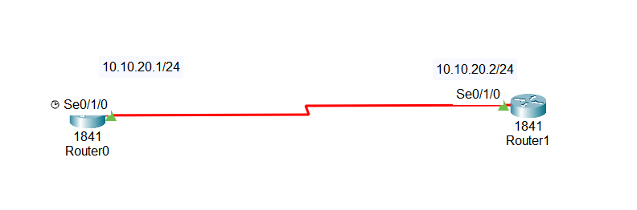

#What is PPP?

PPP is a standard WAN protocol used to connect two routers over a serial link

Works with routers from any vendor (not Cisco-only)

Offers features like:

Authentication (PAP or CHAP)

Data compression

Multi-link support

## 1.How PPP Works

PPP has two main parts:

1.CP – Link Control Protocol

Establishes and manages the PPP connection

Negotiates link options (like authentication)

2.NCP – Network Control Protocol

Configures and supports network layer protocols over PPP

Examples:

IPCP → for IPv4

IPV6CP → for IPv6

ATCP → AppleTalk

IPXCP → IPX

DNCP → DECnet

NBFCP → NetBIOS

## 2.Authentication in PPP

PPP can secure the connection using:

1.PAP – Password Authentication Protocol

Sends password in plain text

Simple, but not secure

Should avoid on high-security networks

2.CHAP – Challenge Handshake Authentication Protocol

Uses three-way handshake and MD5 hashing

Password is never sent in plain text

Authenticates multiple times during connection

More secure than PAP

## 3.Key PPP Rules

Both routers must use the same protocol

Clock rate is set only on DCE side

Enables WAN connectivity over leased line

##📥 Download Packet Tracer Topology

Click below to download the PPP_configuration lab topology:

👉 [Download PPP_configuration Packet Tracer Lab](https://github.com/USERNAME/REPO/raw/main/PPP_configuration.pkt)

Lab Tasks

1. Assign IP address to both routers

2. Set PPP encapsulation

3. Set clocking

Lab configuration

Task 1

Assign IP address to both routers and turn them on

Router0

Router(config)#int se0/1/0

Router(config-if)#ip add 10.10.20.1 255.255.255.0

Router1

Router(config)#int se0/1/0

Router(config-if)#ip add 10.10.20.2 255.255.255.0

Task 2

Set PPP encapsulation

Router0

Router(config)#int se0/1/0

Router(config-if)#encapsulation ppp

Router0

Router(config)#int se0/1/0

Router(config-if)#encapsulation ppp

Task 3

Set clocking on DCE side, which is router 0

Router0

Router(config-if)#clock rate 56000

                    
					## 4.Commmad to check the configuration
					
					1. Check Interface Status
					
					    show ip interface brief
                   
				   2. Check Encapsulation (PPP or HDLC)
				   
				       show interface serial 0/1/0
