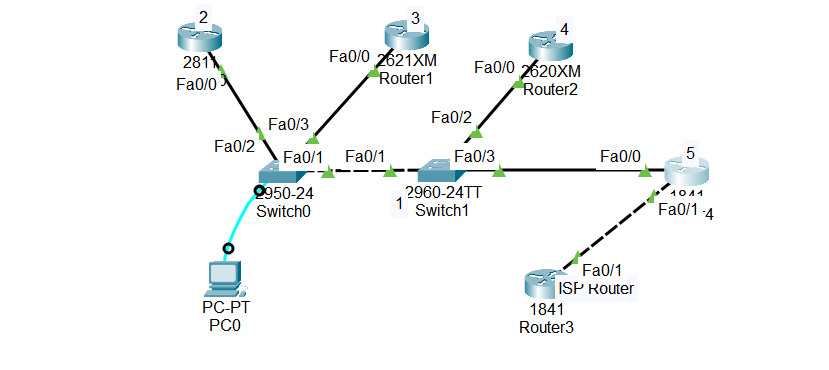

#What is CDP?

CDP is a Cisco proprietary protocol

Used to discover and get information about directly connected Cisco devices

Enabled by default on all Cisco devices

## 1.How CDP Works

- Sends messages every 60 seconds to directly connected devices

- Receives messages from neighbors and stores info in a database

- Provides details about devices without a network diagram

## 2.What Information CDP Provides

Information	Purpose

Hostname	Name of the remote device

Local & Remote Interface	Ports connecting devices

Device Type & Platform	Router, switch, etc.

IP Address	IP of the connected device

IOS Version	Software version running on device

## 3.Security Considerations

CDP can leak network info if exploited by hackers

Best practices:

Disable CDP on interfaces connected to external networks (like ISP)

Use only on internal network links

## 4.CDP Limitations

Works only on Cisco devices

For multi-vendor networks, use LLDP (Link Layer Discovery Protocol)

Industry-standard, supported by many vendors

Functions similar to CDP

## 5.Lab Scenario (Packet Tracer)

Use CDP to discover directly connected devices

Check info such as hostname, IP, interfaces, IOS version

For devices not directly connected, use Telnet to gather info

Disable CDP on external interface (e.g., connecting to ISP):

interface fastEthernet 0/5
 
 no cdp enable

Prevents internal info from being sent outside

##5.Verification Commands

show cdp neighbors        → Shows directly connected devices

show cdp neighbors detail → Shows detailed info (IP, IOS, platform)

##📥 Download Packet Tracer Topology

Click below to download the cdp_config lab topology:

👉 [Download cdp_config Packet Tracer Lab](https://github.com/USERNAME/REPO/raw/main/cdp.pkt)

##6. Lab Tasks

1. Use CDP commands to find out Cisco devices 1 to 5

2. Find out their IPs and interfaces on which they are connected.

3. Disable CDP on interface FastEthernet 0/1 of device 5

Lab configuration

Task 1

Use CDP commands to find out Cisco devices 1 to 5

Use this command on each five devices

show cdp neighbors        → Shows directly connected devices

show cdp neighbors detail → Shows detailed info (IP, IOS, platform)

Task 2

Find out their IPs and interfaces on which they are connected.

enter this command on Switch 1 and switch0

show cdp neighbors        → Shows directly connected devices

show cdp neighbors detail → Shows detailed info (IP, IOS, platform)

Task 3

Disable CDP on interface FastEthernet 0/1 of device 5

device(config)#interface fastethernet 0/1

device(config-if)#no cdp enable

                 

				 ## 7.Commmad to check the configuration

                           1. show directly connected devices:
						   
						      show cdp neighbors
							  
						   2. Shows detailed info (IP, IOS, platform):
						   
						       show cdp neighbors detail
						      
							  
 

