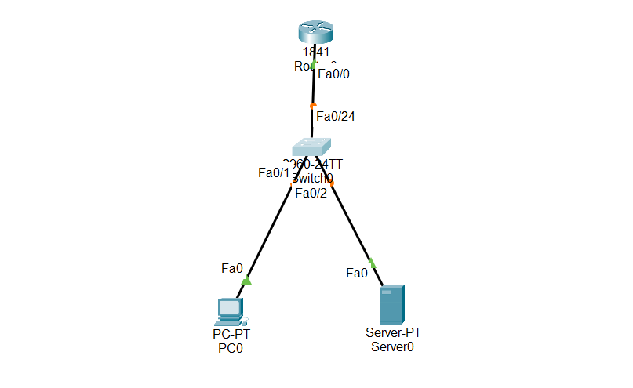
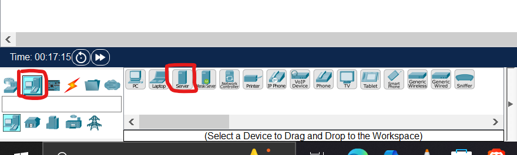
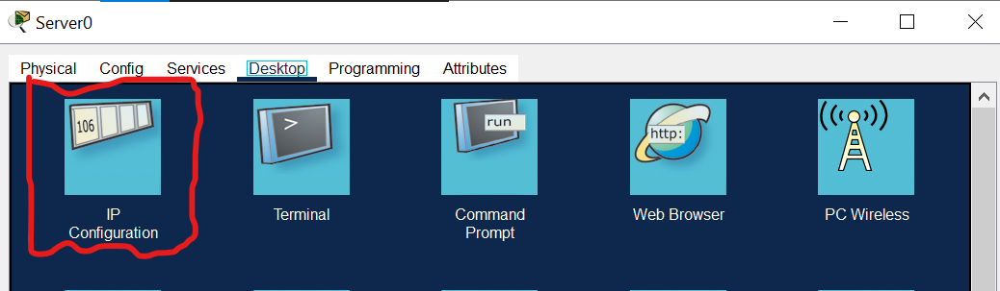
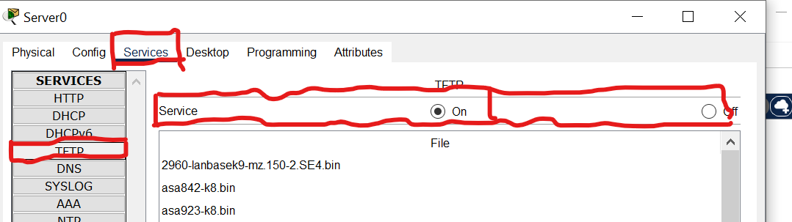
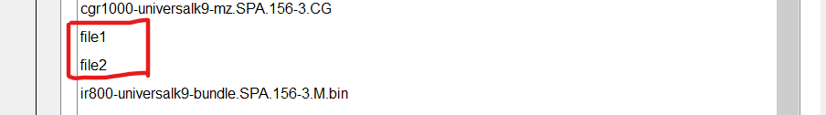
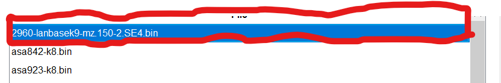

#Overview

TFTP (Trivial File Transfer Protocol) and FTP (File Transfer Protocol) are both used to transfer files over a network, but they are designed for different purposes.

## 1.Copy running and startup-config to TFTP and copy flash to TFTP

In this packet tracer lab, We will back up and restore the files using the following commands.

copy running-config tftp

copy startup-config tftp

copy flash tftp

copy tftp flash

## 2.First of all, we will configure the TFTP server in the packet tracer that we are using to transfer the files.

   

## 📥 Download Packet Tracer Topology

Click below to download the FTP_and_TFTP_config lab topology:

👉 [Download FTP_and_TFTP Packet Tracer Lab](https://github.com/USERNAME/REPO/raw/main/FTP_and_TFTP_config.pkt)

FTP and TFTP servers provide file transferability so using this server, we can back up and restore various files between end devices like PC to PC and we can also use these servers to back and restore running-config, startup-config, and Cisco IOS.

It is always a good practice to save the Cisco device configuration and IOS to the external server so, in the case of hardware failure; we can easily restore the configuration and reduce the significant downtime.

Configuring TFTP and FTP servers in packet tracer is fairly easy. In this lab, we will configure the TFTP server however FTP server can also be configured in the same way.

Step 1
  
  
  
  (TopologyD.png)](TopologyD.png)
  
  We have to attach the server endpoint in our network, packet tracer has provided us with many endpoint devices and one of them is the server, this server provides many services including FTP and TFTP.
  
  
Step 2
  
  
  
  Assign an IP address to the server, the IP address should be of the reachable network; test the connectivity to the server via ping command.
  

Step3
  
  
  
 Make sure that the TFTP service is running, although it is enabled by default however we can double-check it for confirmation.

That is all required to configure the server, now we will save running-config, startup-config, and IOS to the TFTP server.

If we want to backup and restore the switch’s files then we have to configure VLAN 1 interface with an IP address.

We have to use the following commands

Use copy running-config tftp to backup running-config

Switch#copy running-config tftp:

Address or name of remote host []? 192.168.1.5

Destination filename [Switch-confg]? file1

Once we have entered the command then the device will ask for the IP address of the server so we have to enter the IP address then press enter, and then the device will ask us to provide the destination file name, if we press enter without writing anything then the file will be saved with name Switch-config. However, we have given the file name Test-config-1 here so the file will be saved with this name.

Use copy startup-config tftp to backup startup-config

Please note, to export startup-config, please make sure that startup-config is present on the router, and if not then please first save the startup-config.

We have to use the following command.

Switch#copy startup-config tftp:

Address or name of remote host []? 192.168.1.5

Destination filename [Switch-confg]? file2

We have saved the startup-config file with the Test-config-2 name.

 

Some of the newer Cisco devices also have USB ports that allow the backup of the Cisco IOS to USB storage however copying the IOS on the server is the best practice as servers are more stable and are configured with redundant storage.

Use copy flash tftp to backup the IOS

Switch#copy flash: tftp:

Source filename []? 2960-lanbasek9-mz.150-2.SE4.bin

Address or name of remote host []? 192.168.1.5

Destination filename [2960-lanbasek9-mz.150-2.SE4.bin]? (press enter)

IOS of the Cisco device is stored in Flash so we have to copy from flash to the TFTP server. While backing up the IOS, we have to use the exact IOS name so we should copy the IOS name instead of typing it as you can see that IOS names are not easy to type.

We can use the command ‘show flash’ to find out and copy the name of the IOS

After the successful backup, we should be able to see the files in the TFTP server. You can see that all backed-up files are available on the TFTP server.

   

   

To restore the files from the TFTP server, we just have to change the command a bit. We can restore using the copy tftp flash command in the following format.

Switch#copy tftp: flash:

Source filename []? 2960-lanbasek9-mz.150-2.SE4.bin

Address or name of remote host []? 192.168.1.5

Destination filename [2960-lanbasek9-mz.150-2	.SE4.bin]? (press enter)

Please note, while saving the running and startup-config, we have given them a different name in this lab however while copying it to a Cisco device, we must give them the default name as running-config and startup-config as a Cisco device only looks for these names while saving and loading configuration so if we will change the name then the device is not going to recognize it.

