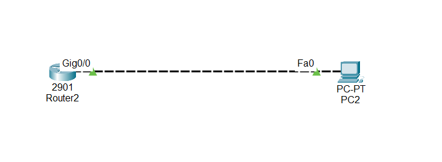

#Overview of DHCP on a Cisco Router

DHCP (Dynamic Host Configuration Protocol) is a service that automatically assigns IP addresses and other network settings to devices (like PCs) on a network. This saves you from manually configuring each device.

When we configure a Cisco router as a DHCP server, it can hand out IP addresses to all connected devices, making network management easier and preventing IP conflicts.

Here’s how it works conceptually:

## 1.Creating a DHCP Pool:

Think of a "pool" as a bucket of IP addresses. You tell the router which range of addresses it can give to devices.

You can give the pool a name, like Dynamic, so it’s easy to identify later.

## 2.Defining the Network Range:

You specify which network the router can assign addresses from, e.g., 192.168.1.0/24.

This tells the router, "You can give IPs in this network range to clients."

## 3.Excluding IP Addresses:

Some IP addresses may need to be fixed (static), like the router’s own IP or a printer.

You exclude these IPs so the DHCP server won’t assign them to other devices, avoiding conflicts.

## 4.Enabling DHCP Service:

By default, DHCP is off on the router. You have to turn it on so it can start giving IPs to clients.

Lease Time (Optional):

A lease is the time a device can keep an IP address before asking for a new one.

You can set it for a specific duration (e.g., 10 days, 10 hours, 10 minutes) or make it infinite.

##📥 Download Packet Tracer Topology

Click below to download the dhcp_CONFIG lab topology:

👉 [Download dhcp_CONFIG Packet Tracer Lab](https://github.com/USERNAME/REPO/raw/main/dhcp_config_Router.pkt)

##5.Lab Tasks

1.Create a DHCP Pool name to Dynamic

2.Defining the Network Range from 192.168.1.0

3.Exclude IP Addresses from 192.168.1.1 192.168.1.4

4.Enable DHCP Service

Lab configuration

Task1

Create a DHCP Pool name to Dynamic

Router(config-if)#ip dhcp pool dyamic

Task2

Defining the Network Range from 192.168.1.0

Router(dhcp-config)#network 192.168.1.0 255.255.255.0

Task3

Exclude IP Addresses from 192.168.1.1 192.168.1.4

Router(dhcp-config)#ip dhcp excluded-address 192.168.1.1 192.168.1.4

Task4

Enable DHCP Service

