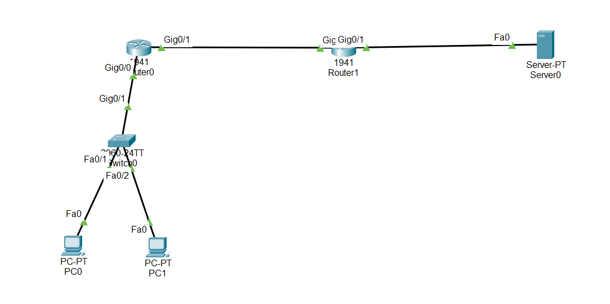
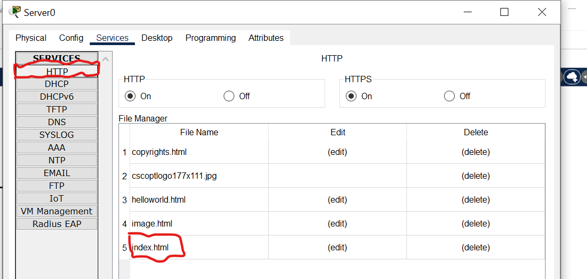
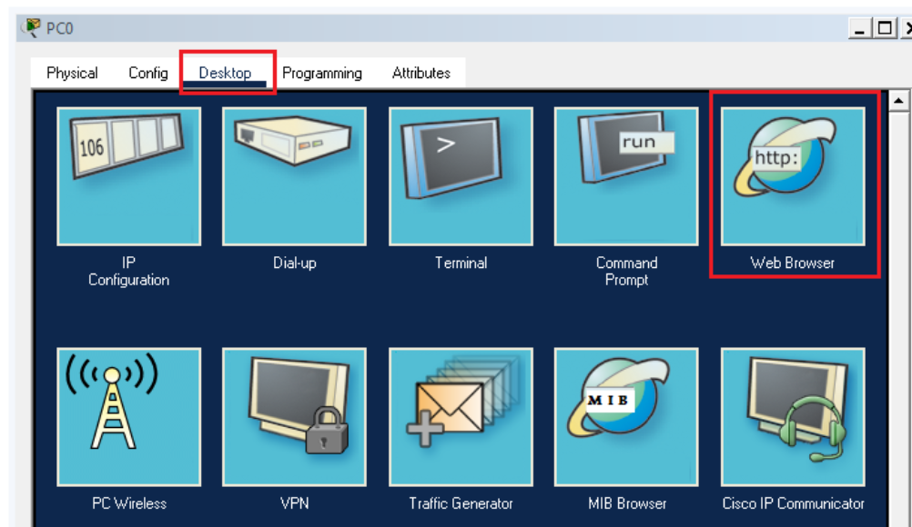
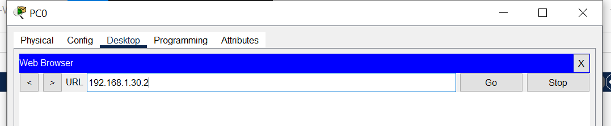

#Overview

A Web Server is a system (software + hardware) that stores, processes, and delivers web pages to users over a network.

When you type a website address (URL) in a browser:

The browser sends a request

The web server responds with a web page (HTML, images, CSS, etc.)

Configure web server in packet tracer to enable internet

How to configure a web server in packet tracer and access the internet in packet tracer

To simulate the internet, we have to configure the server endpoint available

in the packet tracer. This server has the capability to provide web service.

##📥 Download Packet Tracer Topology

Click below to download the Web_server_config lab topology:

👉 [Download Web_server_config Packet Tracer Lab](https://github.com/USERNAME/REPO/raw/main/Web_server_config.pkt)

We have two hosts that will be able to access the internet via an ISP router. 

Our internal network is connected to the ISP router. 

The interface of the internal router which is connected to the ISP router has been given public IP address. 

This is static IP that has been configured on the interface.

ISP router is further connected to the Google web server so after the successful configuration of our network, we should be able to access the google.com

How to configure the web server

We have to open services and click on HTTP service. This service is enabled

by default and we can see that server is hosting some files already. These files

are present by default and when we point the web browser to this server,

this server will serve the web page to our browser.

We have configured this server as a Google web server and it is 

serving a Google web page. To change the content of the webpage, 

we have to edit the index file present in the web server.

For testing purposes, we can copy the source code of any side that
you want the webserver to show and paste it into the index file. After saving the 
file, the web server will show sites according to the source code.

Now, we can test the web server by opening the browser on the PC and pointing it to the server.

We have to enter the IP address of the web server in the URL and press enter. 
If everything is configured properly then we should 
see the browser loading the webpage successfully.

Before opening the browser, we must make sure that the connectivity of the server is fine.
Download the lab and test the Google web server and if you want the server
to host any other site then change  index file present on the server.

This lab is the smaller presentation of a big network like the internet. 
This is the way how the internet works however there are thousands of 
routers and servers connected forming a huge network.

You can try adding more servers with different sites and accessing those sites on the browser of the PC.

