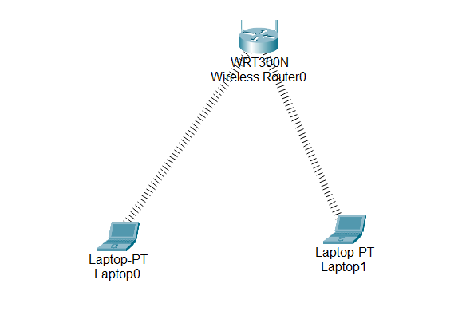
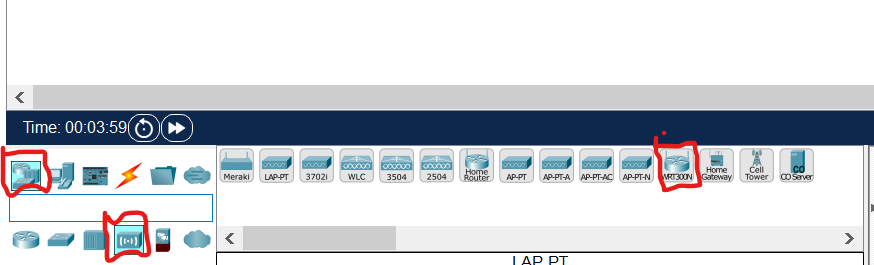
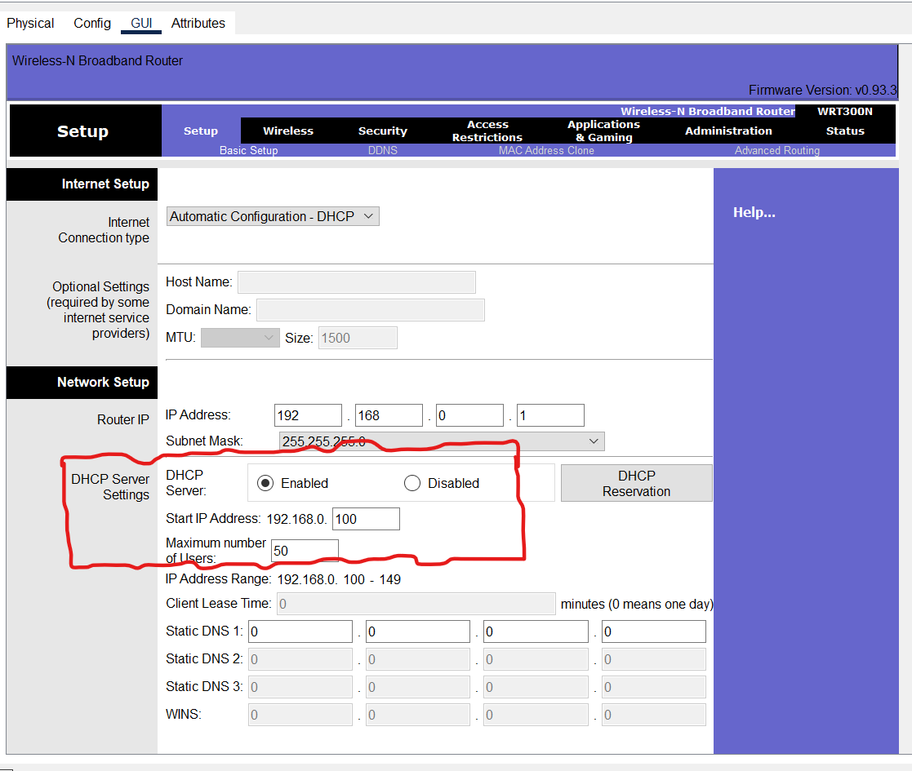
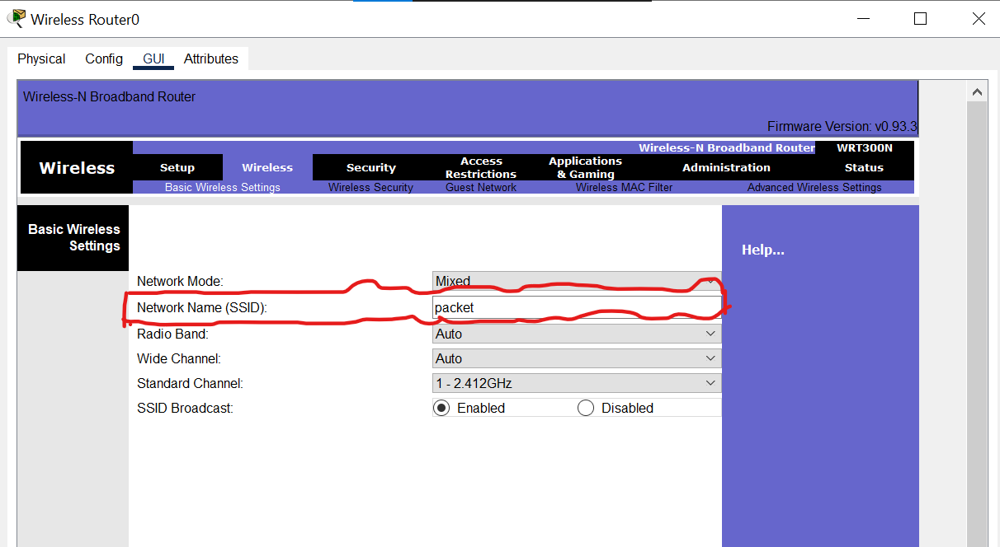
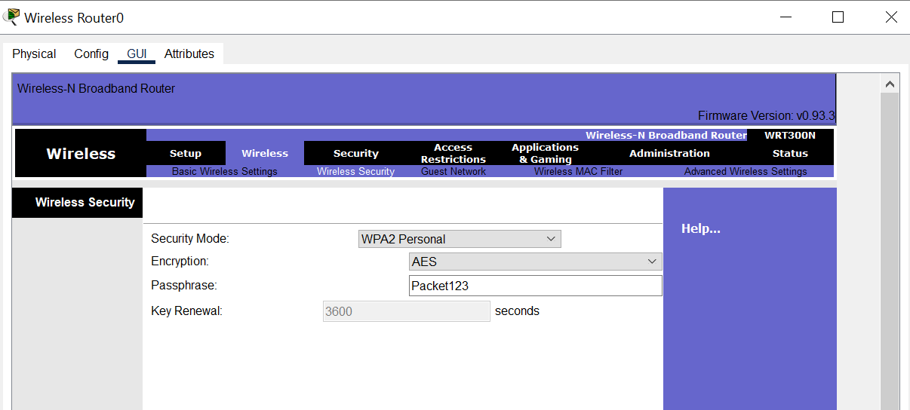
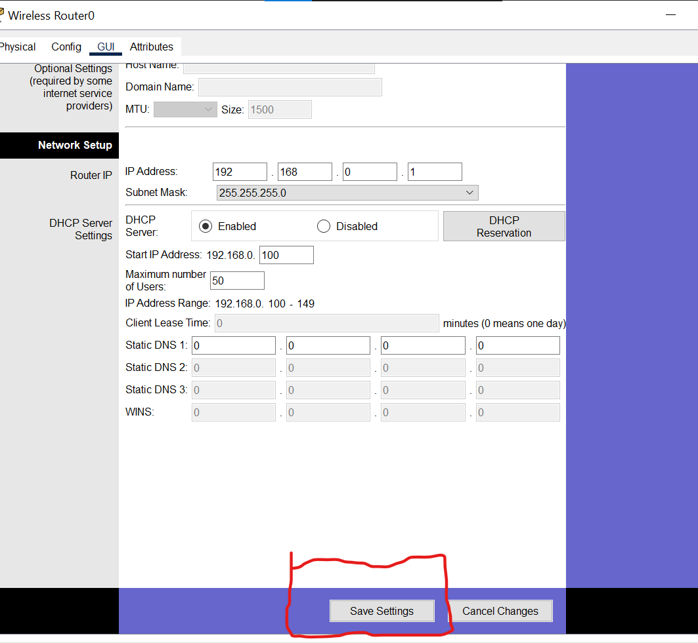
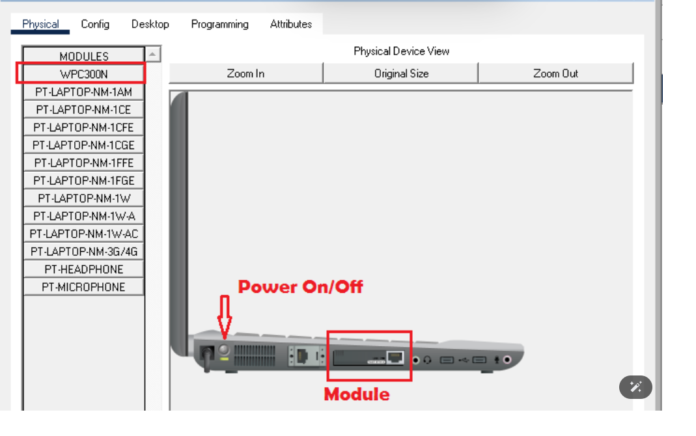
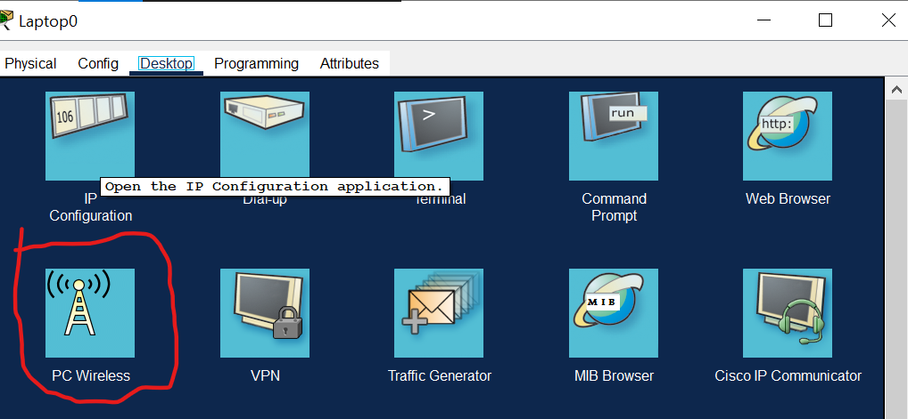
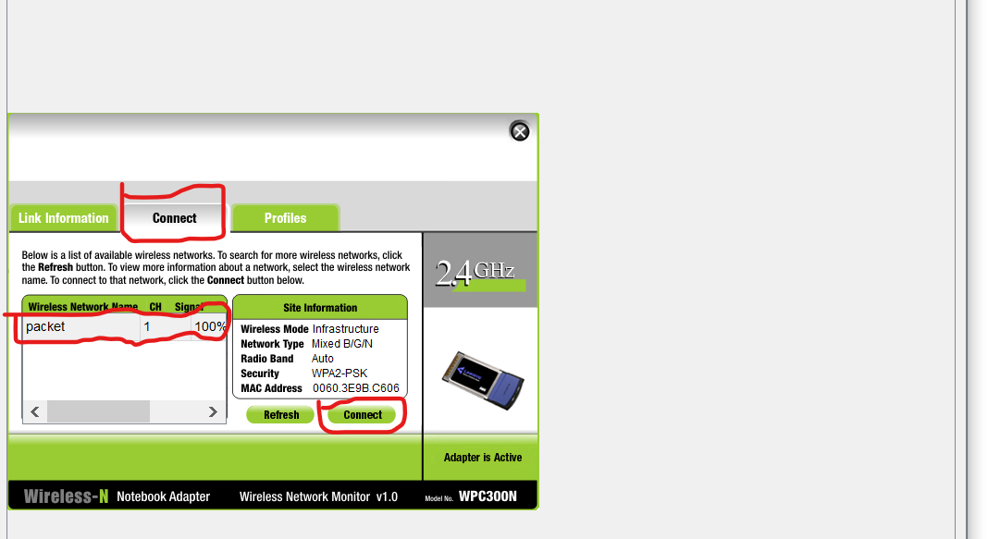
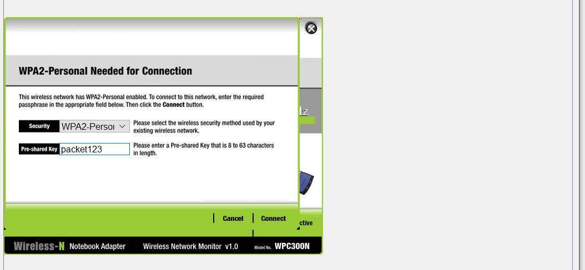

Configure WiFi in Cisco packet tracer

In this lab, we will configure WIFI in Cisco packet tracer and we will be enabling the laptop for wireless connection using a wireless router

##📥 Download Packet Tracer Topology

Click below to download the Web_server_config lab topology:

👉 [Download Web_server_config Packet Tracer Lab](https://github.com/USERNAME/REPO/raw/main/Web_server_config.pkt)

Configuring a wireless router and creating a wireless network is easy in a packet tracer. It is almost the same as configuring the home wireless router.

There are varieties of wireless devices given in the packet tracer so we will select the wireless router WRT300N from the list.

Now, we have to configure the wireless router. Most of the settings are already configured on the wireless router required to establish a wireless network however, we can change the configuration as per our requirement and enable features like an access list, MAC address filtering, firewall, etc.

We can change the DHCP scope as per our requirements however in this lab but we will keep those settings to default.

SSID is configured as ‘default’ but we will change that to ‘packet’ and wireless security is disabled by default on the router so we will enable security and set up a password.

WPA2personal security mode has been selected and password packet123 has been configured on the router.

After configuring the router, we must save the setting. The save button is not visible on the screen until we scroll down.

Now, we will configure the laptops so they can join the wireless network.

By default, the laptop does not have a WPC300N module installed and there is no extra space to install the module so we have to remove the Ethernet module and replace it with a WPC300N module.

Configure WiFi in Cisco packet tracer
In this lab, we will configure WIFI in Cisco packet tracer and we will be enabling the laptop for wireless connection using a wireless router
wireless network

Download

Configuring a wireless router and creating a wireless network is easy in a packet tracer. It is almost the same as configuring the home wireless router.

There are varieties of wireless devices given in the packet tracer so we will select the wireless router WRT300N from the list.

wireless router packet tracer

Now, we have to configure the wireless router. Most of the settings are already configured on the wireless router required to establish a wireless network however, we can change the configuration as per our requirement and enable features like an access list, MAC address filtering, firewall, etc.

dhcp range

We can change the DHCP scope as per our requirements however in this lab but we will keep those settings to default.

ssid

SSID is configured as ‘default’ but we will change that to ‘packet’ and wireless security is disabled by default on the router so we will enable security and set up a password.

wireless password

WPA2personal security mode has been selected and password packet123 has been configured on the router.

After configuring the router, we must save the setting. The save button is not visible on the screen until we scroll down.

Now, we will configure the laptops so they can join the wireless network.

By default, the laptop does not have a WPC300N module installed and there is no extra space to install the module so we have to remove the Ethernet module and replace it with a WPC300N module.

module change

Before changing the module, the laptop must be powered off otherwise, the module cannot be changed.

If we will not change any setting on the router then changes are not required on the laptop as well because the laptop is preconfigured with the SSID and a password is not required so the laptop will establish the connection with the router just by installing the wireless module.

As we have changed the SSID and password on the router, we should configure the laptop with the required information.

The laptop will establish a connection when configured with the appropriate SSID and password. Now, we can open the GUI of the wireless router on the PC wireless of the laptop.

click on wireless and you can see this one after click on connect

finally you enter the credentials

