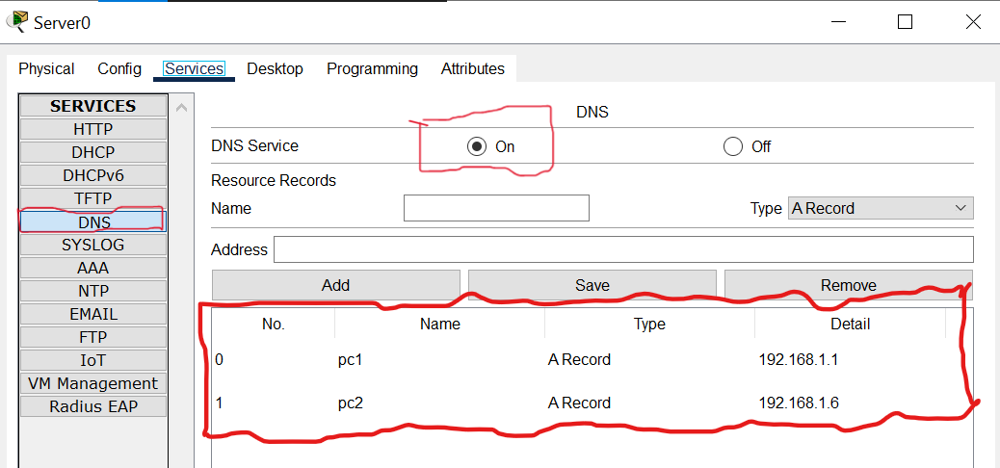
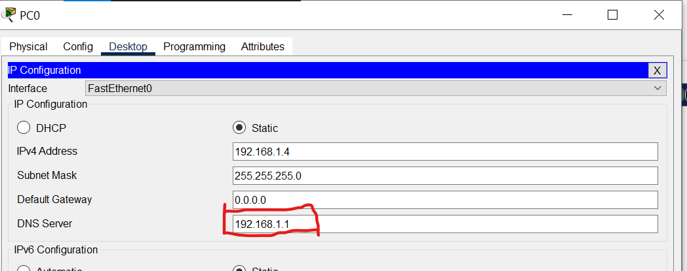
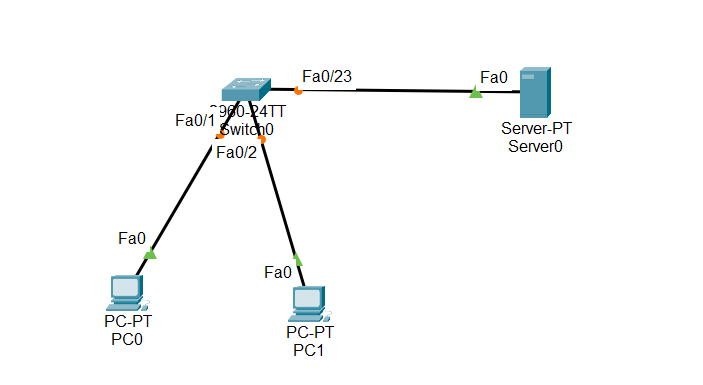

Overview

DNS in Cisco packet tracer and how to configure DNS on Cisco router

There are a couple of ways in which we can configure DNS in packet tracer. 
We will configure DNS on the Cisco router and endpoint server.

DNS means domain name server, and DNS contains a database of domain names and IP mapping. 
DNS servers are very helpful as we don’t have to remember the IP address 
and we can use the domain name instead. Names are much easier to type
and learn so DNS plays an important role in every network.

When we enter google.com in the web browser the DNS server 
finds out the mapped IP of that domain and the HTTP request 
is forwarded to that IP address.

Configure DNS on the Cisco router

To configure the Cisco router as DNS, we have to enable the DNS service on the router using the following command.

Router(config)#ip dns server

Now, we have to map the names with the IP address using the following command.

Router(config)#ip host PC1 192.168.1.5

Router(config)#ip host PC2 192.168.1.6

Finally, we need to configure the DNS server IP in the PC setting. In this case,
 as the router is configured as a DNS server, we will use the router’s IP.

Now, we can ping one PC from another PC with their names.

Please note that Configuring the Cisco router as a DNS server is not possible in packet tracer as
it does not provide this functionality however If you want to 
try this lab then you can use GNS3 as it has all the commands.

Configuring DNS in Cisco packet tracer with the available server endpoint

To configure the DNS server, we have to enable the DNS 
service in the server which is disabled by default.

Now, we have to add an A record or create a name for IP mapping in the server.

Finally, PCs should be configured with the IP address of the server in the DNS settings.

That is all required to successfully enable the DNS server in packet tracer.

Now, we should be able to ping the PCs with the names

C:\>ping pc2

Pinging 192.168.1.6 with 32 bytes of data:

Reply from 192.168.1.6: bytes=32 time=34ms TTL=128

Reply from 192.168.1.6: bytes=32 time=11ms TTL=128

Reply from 192.168.1.6: bytes=32 time=12ms TTL=128

Reply from 192.168.1.6: bytes=32 time=5ms TTL=128

As expected, we can ping one PC from another with the names.

##📥 Download Packet Tracer Topology

Click below to download the DNS_config lab topology:

👉 [Download DNS_config Packet Tracer Lab](https://github.com/USERNAME/REPO/raw/main/DNS_config.pkt)

 