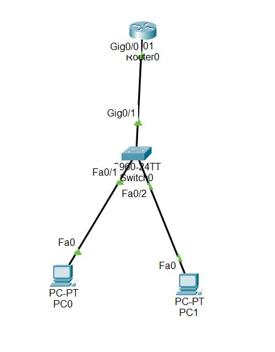

#What is a VTY line?

VTY stands for Virtual Teletype.

It’s an interface on Cisco routers and switches that allows remote access to the device.

Remote access is usually done through Telnet or SSH.

You use VTY lines to login remotely and manage the device without being physically connected.

💡 Think of it like a virtual console that allows multiple people to connect to a router or switch at the same time.

##1. Line VTY 0 4

Cisco devices can support multiple simultaneous remote connections.

line vty 0 4 means you are configuring 5 VTY lines at once: 0, 1, 2, 3, 4.

This allows up to 5 users to connect remotely at the same time.

If you need only one line, you can use line vty 0.

Important:

Always put a space between the numbers (0 4).

line vty 04 will cause an error.

##2. Line VTY 5 15

Older Cisco devices supported only 5 VTY lines (0–4).

Newer devices support up to 16 VTY lines (0–15).

line vty 5 15 allows you to configure the remaining lines (5 to 15).

This is useful if more than 5 simultaneous remote users need access.

##3. Line VTY 0 15

This command allows you to configure all available VTY lines at once.

Most admins still use line vty 0 4 out of habit, because older systems only supported 5 lines.

Using line vty 0 15 is helpful when you want all remote access lines configured at once.

##📥 Download Packet Tracer Topology

Click below to download the telnet_config lab topology:

👉 [Download telnet_config Packet Tracer Lab](https://github.com/USERNAME/REPO/raw/main/telnet_config.pkt)

Lab Tasks

1.Select the VTY line to configure

2.Set a password ali 

3.Enable login using that password

NB:before configuaring telnet you have set previledge password to ali

Lab configuration

Task1

Select the VTY line to configure

Router(config)#line vty 0 4

Task2

Set a password

Router(config-line)#password ali

Task3

Enable login using that password

Router(config-line)#login

NB:

Encrypted (type 7)

Router(config-line)# password 7 [encrypted_password]

Requires converting your password to type 7 first.

Safer than clear text.

